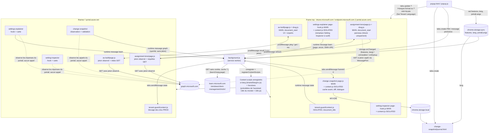
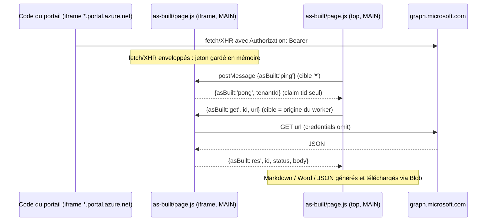
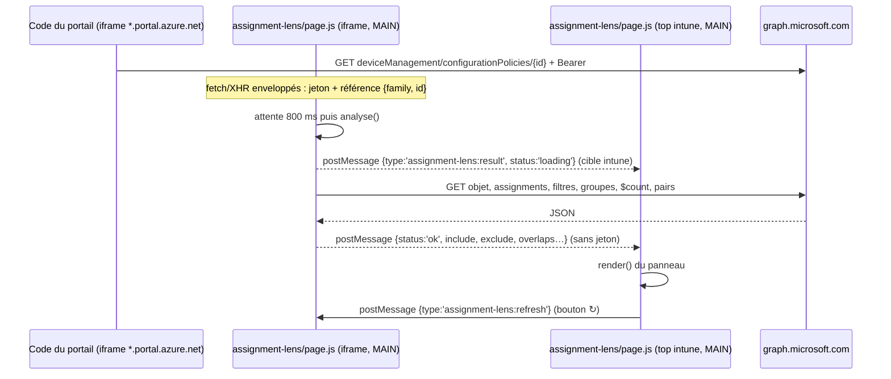
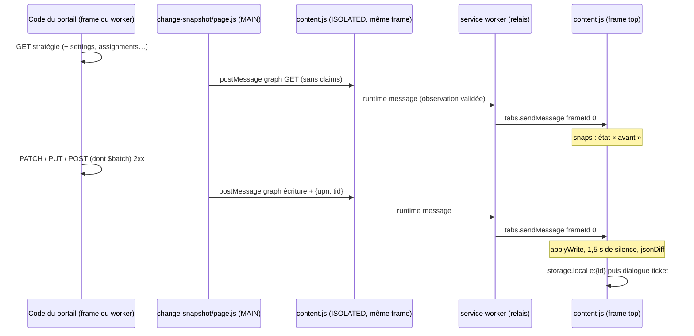

# Tenant Compass : architecture

Document destiné aux mainteneurs. Il décrit ce que fait réellement le code de `tenant-compass/` (version `0.9.3` du manifeste). Les points non confirmés par la lecture du code sont marqués **à vérifier**.

---

## 1. Vue d'ensemble

Tenant Compass est une extension Chrome / Edge (**Manifest V3**, Chrome ≥ 111) qui ajoute sept fonctions au portail d'administration Microsoft, chacune activable séparément depuis le menu (popup) :

| Fonction | Rôle en une ligne |
|---|---|
| **Tenant Guard** | Bandeau et cadre coloré du tenant actif, confirmation avant toute action d'écriture dans un tenant marqué PROD. |
| **As-Built** | Bouton flottant : export des stratégies Intune en Markdown, Word (.doc) et JSON, plus les scripts (.ps1 / .sh). |
| **Setting Inspector** | Carte au survol d'un paramètre du catalogue, section détails : ID, OMA-URI / clé, licence, version OS min., GPO, liens Learn. |
| **Settings Explainer** | Même carte, section explication (texte rédigé, page CSP Learn lue en direct, valeurs, valeur par défaut). Activable seule. |
| **OpenIntuneBaseline** | Même carte, section OIB : valeur configurée par la baseline communautaire OpenIntuneBaseline (GPL-3.0) et stratégie concernée. Activable seule. |
| **Assignment Lens** | Panneau sur une stratégie ou une application : groupes inclus / exclus, nombre de membres, filtres, chevauchements. |
| **Change Snapshot** | Journal local des modifications de stratégies faites dans le portail : diff avant / après, auteur, n° de ticket, export JSON / CSV. |
| **Set Tenant Language** | Boutons « 🌐 » empilés à gauche des pastilles du menu : rechargent l'onglet de la console dans la Langue 1 ou la Langue 2 prédéfinies. |
| **Raccourci PIM** | Boutons violets « 🔑 PIM éligible » / « 🔑 PIM actif » du menu : ouvrent PIM > Mes rôles sur le tenant détecté dans l'onglet actif. |

Principes :

- **Aucune inscription d'application dans le tenant.** As-Built et Assignment Lens réutilisent le jeton Graph que le portail utilise déjà (observé en mémoire). Tenant Guard, Setting Inspector, Settings Explainer, Change Snapshot, Set Tenant Language et le Raccourci PIM n'appellent jamais Graph (Change Snapshot observe seulement les appels du portail). Settings Explainer lit des pages publiques de `learn.microsoft.com` depuis le service worker (section 4.7).
- **Pas d'étape de build.** Le dossier se charge tel quel comme extension décompressée. Pas de bundler, pas de dépendance npm.
- **JavaScript vanilla.** Chaque fonction sépare un `lib.js` pur (testable sous Node via `module.exports`) et un script de page qui touche au DOM et au réseau (Set Tenant Language et le Raccourci PIM n'ont pas de script de page : leur `lib.js` est chargé par le popup, et par le service worker pour PIM).
- **Bilingue FR / EN** : le menu et les textes affichés dans le portail suivent la langue choisie dans le menu (section 5.3).
- Tout le code vit dans `tenant-compass/` : il n'existe plus de version autonome des fonctions dans le dépôt.

---

## 2. Arborescence

```
tenant-compass/
├── manifest.json                 MV3 : permissions, host_permissions, service worker, popup, ressources web accessibles
├── background.js                 Service worker : enregistre le marqueur de langue `ui-lang` et les content scripts des fonctions actives (avec leurs dictionnaires), importe les relais
├── popup.html                    Menu de l'extension (aussi page d'options ouverte en onglet)
├── popup.js                      Pastilles des fonctions actives, colonne Set Tenant Language, boutons PIM, paramètres ⚙, bascules générées, « Positions par défaut », bouton de rechargement
├── README.md                     Guide utilisateur (français)
├── README.en.md                  Guide utilisateur (anglais)
├── ARCHITECTURE.md               Ce document
├── LICENSE                       Licence propriétaire
├── icons/icon{16,32,48,128}.png  Icônes
├── docs/img/readme/{fr,en}/        Captures du README (01 à 16) en français et en anglais, prises dans un tenant de test anonymisé (Contoso)
├── shared/
│   ├── drag.js                   Déplacement à la souris + mémorisation de position (MAIN world)
│   ├── i18n.js                   Dictionnaires FR / EN du menu (60 clés), t(), applyI18n(), setLang(), i18nReady (popup uniquement)
│   ├── i18n-page.js              Assistant i18n des scripts MAIN et du Journal : globalThis.__tenantCompassI18n { lang(), add(), t() }
│   ├── i18n-page-isolated.js     Copie identique, injectée dans le monde ISOLATED (un fichier ne s'injecte qu'une fois par frame)
│   └── lang/{fr,en}.js           Marqueur enregistré par background.js : pose <html data-tenant-compass-lang>
├── tenant-guard/
│   ├── background.js             Importé par le service worker : état du tenant par onglet, badge
│   ├── content.js                Détection du tenant, bandeau, blocage des clics PROD (ISOLATED world)
│   ├── lib.js                    Fonctions pures : signaux URL / MSAL, règles, mots-clés gardés, import
│   ├── i18n.js                   Dictionnaire FR / EN des textes dans le portail (8 clés)
│   ├── options.js                Partie Tenant Guard du popup : édition des tenants, couleurs, import / export
│   └── test.js                   Tests Node
├── as-built/
│   ├── lib.js                    Fonctions pures : résumés, lignes de paramètres, Markdown, Word, JSON, scripts
│   ├── i18n.js                   Dictionnaire FR / EN (82 clés : UI et titres des exports)
│   ├── page.js                   Observation du jeton, relais GET entre frames, UI et exports (MAIN world)
│   └── test.js                   Tests Node
├── setting-inspector/
│   ├── lib.js                    Fonctions pures : normalize, omaUri, lookup, licenseFor, slim, buildDb, extractDefs
│   ├── oib.js                    Section OpenIntuneBaseline de la carte : oibFor, oibValue, oibBlock, textes FR / EN (ISOLATED world)
│   ├── test.js                   Tests Node
│   ├── LICENSE-RULES-MAINTENANCE.md  Procédure de mise à jour des règles de licence
│   ├── tools/build-db.mjs        Régénère data/settings.json depuis Graph (Node 18+, GRAPH_TOKEN)
│   ├── tools/build-oib.mjs       Régénère data/oib.json depuis un clone d'OpenIntuneBaseline (Node 18+)
│   └── data/
│       ├── settings.json         Base de définitions embarquée (graine : 12 entrées)
│       ├── overlay.json          `_licenseRules` (11 règles) + surcharges par ID (GPO, licence)
│       ├── oib.json              Paramètres configurés par OpenIntuneBaseline, par settingDefinitionId (GPL-3.0)
│       ├── OIB-NOTICE.md         Crédit, modifications, source correspondante, absence de garantie (GPL-3.0)
│       └── OIB-LICENSE.txt       Texte de la GPL-3.0
├── settings-explainer/
│   ├── page-hook.js              Copie de celui de Setting Inspector + champs d'explication (description, options, défaut, risque) ; attribut data-se-def (MAIN world)
│   ├── content.js                Carte de paramètre : sections OIB, explication et détails selon les modules actifs, ancrée au bord droit, délai de fermeture réglable (ISOLATED world)
│   ├── lib.js                    lib.js de Setting Inspector + slim() étendu, explain(), learnTarget(), learnGpo()
│   ├── csp.js                    Analyse d'une page CSP Learn (marqueurs <!-- X-Section-Begin -->), findDoc(), learnUrl() (service worker)
│   ├── background.js             Importé par le service worker : lecture des pages Learn, cache 7 jours
│   ├── i18n.js                   Dictionnaire FR / EN de la carte
│   ├── test.js                   Tests Node
│   └── data/explain.json         Explications rédigées (niveau 3), FR / EN, par ID de paramètre
├── assignment-lens/
│   ├── lib.js                    Fonctions pures : familles Graph, parsing d'URL, jeton dans un message, chevauchements
│   ├── i18n.js                   Dictionnaire FR / EN (39 clés)
│   ├── page.js                   Observation Graph, requêtes GET, panneau (MAIN world)
│   └── test.js                   Tests Node
├── change-snapshot/
│   ├── lib.js                    Fonctions pures : parsing d'URL, $batch, nettoyage / masquage, avant / après, diff, claims JWT, CSV
│   ├── page.js                   Observation fetch / XHR / Web Workers, décodage upn / tid (MAIN world)
│   ├── content.js                Validation, relais, cache « avant », journalisation, dialogue ticket (ISOLATED world)
│   ├── background.js             Importé par le service worker : relais frame → frame top de l'onglet
│   ├── i18n.js                   Dictionnaire FR / EN (36 clés : dialogue et page Journal)
│   ├── journal.html / journal.js Page Journal : filtres, détail, export JSON / CSV, vidage
│   ├── README.md                 Fonctionnement détaillé, sécurité, limites, endpoints couverts
│   └── test.js                   Tests Node
├── portal-language/
│   ├── lib.js                    Set Tenant Language : LANGUAGES (24), FORMATS (30), isPortal(), portalUrl() (chargé par le popup)
│   └── test.js                   Tests Node
└── pim/
    ├── lib.js                    Raccourci PIM : pimUrl(), selectActiveTab() (chargé par le popup et le service worker)
    └── test.js                   Tests Node
```

`setting-inspector/tools/build-db.mjs` régénère `setting-inspector/data/settings.json` (même format, via `buildDb` de `lib.js`) : procédure dans `README.md`, section Setting Inspector.

---

## 3. Schéma d'ensemble



`portal.azure.com` reçoit Tenant Guard et Change Snapshot. Les autres consoles d'administration (`entra`, `aad.portal.azure.com`, `security`, `admin.microsoft.com`, `admin.cloud.microsoft` dont Exchange, `purview`, `compliance`, `admin.exchange`, `admin.teams`, `*.sharepoint.com`) ne reçoivent que Tenant Guard ; sur `*.sharepoint.com`, Tenant Guard n'agit que sur `<tenant>-admin.sharepoint.com` (`isAdminConsole`), jamais sur les sites utilisateur. Le frame top de Change Snapshot passe lui aussi par le relais du service worker pour ses propres observations. Le marqueur de langue `ui-lang` est injecté dans toutes les frames de tous les portails (`PORTALS` : les `host_permissions` sans `learn.microsoft.com`), que des fonctions y soient actives ou non. Rien n'est injecté dans `learn.microsoft.com`, que seul le service worker lit pour Settings Explainer. Set Tenant Language n'injecte rien : le popup modifie seulement l'URL de l'onglet actif. Le Raccourci PIM n'injecte qu'une fonction ponctuelle (`executeScript`) dans l'onglet PIM qu'il vient d'ouvrir (bouton « actif »).

---

## 4. Fonctions

Les tableaux « Scripts » ci-dessous donnent les fichiers propres à chaque fonction. À l'enregistrement, `withI18n` (`background.js`) ajoute **en tête** de chaque liste `js` : l'assistant (`shared/i18n-page.js` en MAIN, `shared/i18n-page-isolated.js` en ISOLATED) puis `<fonction>/i18n.js` (dossier déduit du dernier fichier de la liste). Les hooks MAIN qui n'affichent rien (`i18n: false` : hooks de Setting Inspector, Settings Explainer, Change Snapshot) n'en reçoivent pas. Voir section 5.3.

### 4.1 Tenant Guard

**Rôle.** Identifier le tenant affiché, afficher un bandeau (pastille en haut au centre + cadre coloré si le tenant est référencé), et demander confirmation avant un clic d'écriture quand le tenant est marqué PROD.

**Scripts.**

| ID enregistré | Fichiers | World | run_at | allFrames | matches |
|---|---|---|---|---|---|
| `tenant-guard` | `tenant-guard/lib.js`, `tenant-guard/content.js` | ISOLATED (défaut) | `document_idle` | oui | tous les portails (`PORTALS` : `host_permissions` sans `learn.microsoft.com`) |

Plus `tenant-guard/background.js`, chargé par `importScripts` dans le service worker **même quand la fonction est désactivée** (ses écouteurs restent alors inactifs faute de messages). `tenant-guard/options.js` tourne dans le popup.

**Flux.**

1. Frame top : `detect()` toutes les 1,5 s (`setInterval`). Page utilisateur d'un hôte partagé (site SharePoint, `isAdminConsole` faux) : état `off`, ni bandeau ni garde. Signaux, par priorité : paramètres d'URL `tid` / `tenantId` / `tenant` / `ctid` et `#@domaine` (`urlSignals`), nom d'annuaire `.fxs-avatarmenu-tenant`, realm MSAL trouvé dans les **noms de clés** `localStorage` / `sessionStorage` du portail (`storageRealms`, formats MSAL v2 `-login.windows.net-` et v3+ `msal.N|…|login.windows.net|…`, ignoré si plusieurs realms), sinon tenant de la session du shell Microsoft 365 (`shellTenant` : `sessionStorage` `sessionTracking_ActiveAccountIdentifier` → entrée `localStorage` avec `tenantId`, utile sur `admin.cloud.microsoft` où MSAL v5 ne laisse pas de clé).
2. `matchRule` compare les signaux aux règles (`chrome.storage.sync` `rules`) ; la première correspondance gagne. Si la règle a été trouvée par le **nom d'annuaire** et que l'ID de tenant n'appartient à aucune règle, `learnTenantId` l'ajoute à la correspondance de la règle (écriture `rules`) : la même règle reconnaît ensuite les consoles qui n'exposent que l'ID (Defender, Admin M365). Jamais depuis un `?tid=` (GDAP).
3. Si l'état change : rendu du bandeau (Shadow DOM ouvert, hôte `#tenant-guard`) et `chrome.runtime.sendMessage({ type: 'state' })`.
4. `tenant-guard/background.js` stocke l'état dans `chrome.storage.session` (`t<tabId>`), le renvoie aux frames de l'onglet (`chrome.tabs.sendMessage`), met le badge `PROD` et sa couleur.
5. Iframes : `getState` au chargement, puis mise à jour à chaque message `state`.
6. Toutes les frames : écouteur `click` en phase de capture sur `window`. Si `state.prod` et que le texte du bouton correspond à `GUARDED` (EN / FR : save, enregistrer, delete, supprimer, assign, créer, wipe, retire, review + save…), le clic est annulé et une boîte modale demande confirmation ; « Confirmer » rejoue `el.click()` une fois (`bypass`).

**Aucun appel Graph.**

**Stockage.** `chrome.storage.sync` : `rules` (dont l'ID de tenant appris), `customColors`. `chrome.storage.session` : `t<tabId>`. Lecture seule des noms de clés `localStorage` / `sessionStorage` du portail et de l'entrée de session du shell Microsoft 365 (`tenantId` seulement).

**Interface de l'extension.** Les clics dont le chemin passe par un hôte de Tenant Compass (`#tenant-guard`, `#as-built-host`, `#assignment-lens`, `#setting-inspector`, `#settings-explainer`, `#change-snapshot`) ne sont jamais gardés : ces boutons n'écrivent que des données locales (par exemple « Enregistrer » du journal Change Snapshot).

**UI.** Pastille fixe en haut au centre, cadre de 4 px (6 px en PROD), modale de confirmation (focus par défaut sur « Annuler »). Dans le popup : carte « onglet actuel » (signaux détectés, bouton « Référencer » qui crée **une** règle avec tous les signaux non référencés : nom et ID) et tableau des tenants (correspondance, étiquette, couleur, PROD), export JSON, import (ouvre la page d'options en onglet car le sélecteur de fichier ferme le popup ; idem pour le sélecteur de couleur libre). Le choix de couleur (`<details class="pick">`) est une grille de 5 colonnes de 164 px de large : ligne 1, les 5 couleurs par défaut (`PRESETS`) ; ligne 2, les 5 couleurs enregistrées (`customColors`, la première forcée en colonne 1) ; dessous, curseurs teinte / luminosité, code hex, « Autre… » et « Enregistrer ».

**`lib.js`.** `isAdminConsole`, `urlSignals`, `storageRealms`, `shellTenant`, `matchRule`, `learnTenantId`, `isGuarded`, `mergeRules` (import non fiable : filtrage, troncature, couleur hex forcée, fusion par `match`).

**Tests.** `tenant-guard/test.js` : consoles d'administration (SharePoint admin oui, sites non), signaux URL, realms MSAL (v2 et v3+), session du shell M365, correspondance des règles, apprentissage de l'ID de tenant, mots-clés gardés (positifs et négatifs), fusion d'import.

### 4.2 As-Built

**Rôle.** Lister les stratégies Intune et les exporter (Markdown, Word, JSON, copie Markdown), un fichier par stratégie ou un seul fichier, avec les scripts décodés en fichiers séparés.

**Scripts.**

| ID enregistré | Fichiers | World | run_at | allFrames | matches |
|---|---|---|---|---|---|
| `as-built` | `shared/drag.js`, `as-built/lib.js`, `as-built/page.js` | MAIN | `document_start` | oui | `intune.microsoft.com`, `endpoint.microsoft.com`, `*.portal.azure.net` |

**Flux.**

1. Toutes les frames : `window.fetch` et `XMLHttpRequest.prototype.open` / `setRequestHeader` sont enveloppés. Un en-tête `Authorization: Bearer …` envoyé à `https://graph.microsoft.com` est gardé dans la variable `token` de la closure.
2. Iframes (worker) : écoute `message`. Accepte seulement si `e.source === window.top`, `e.origin` ∈ {`https://intune.microsoft.com`, `https://endpoint.microsoft.com`} et un jeton est présent. `ping` → `pong` avec le claim `tid` (pas le jeton). `get` → `graphGet(url)` → `res` (statut + corps JSON).
3. Frame top (seulement sur les deux origines UI) : si elle a elle-même un jeton, elle appelle Graph directement ; sinon `findWorker()` envoie `ping` à toutes les frames (`'*'`, message sans donnée), attend 2 s le premier `pong` dont l'origine correspond à `WORKER_ORIGIN`, puis relaie chaque requête (délai 60 s). Un 401 oublie le worker.
4. `graphGet` refuse toute URL hors `^https://graph.microsoft.com/(beta|v1.0)/`, force `method: 'GET'` et `credentials: 'omit'`.

Endpoints Graph (beta) appelés :

| Usage | Endpoint |
|---|---|
| Liste | `deviceManagement/configurationPolicies`, `deviceConfigurations`, `deviceCompliancePolicies`, `groupPolicyConfigurations`, `deviceManagementScripts`, `deviceShellScripts`, `deviceHealthScripts` ; `deviceAppManagement/mobileApps` |
| Détail catalogue | `configurationPolicies/{id}`, `.../settings?$expand=settingDefinitions`, `configurationCategories/{id}` (remonte les parents) |
| Détail ADMX | `groupPolicyConfigurations/{id}/definitionValues?$expand=definition`, `.../presentationValues?$expand=presentation` |
| Détail autres | `{collection}/{id}` (conformité : `$expand=scheduledActionsForRule(...)`) |
| Affectations | `{collection}/{id}/assignments`, `groups/{id}?$select=id,displayName`, `deviceManagement/assignmentFilters/{id}` |

Pagination par `@odata.nextLink` (sans limite). Parallélisme borné par `pool()` (3 à 4). Cache mémoire `memo` par clé.



**Langue des exports.** Les textes générés par `lib.js` (types, titres et en-têtes Markdown / Word, libellés) passent par `T(key, frDefault)` : `__tenantCompassI18n.t(key)` dans la page, le défaut français inline sous Node (tests). Les exports suivent donc la langue du menu au moment du chargement de l'onglet.

**Données exportées.** Valeurs secrètes masquées (`(secret masqué)`) : `SecretSettingValue` du catalogue et valeurs OMA-URI `isEncrypted`. JSON : `exportedAt`, `tenantId` (claim `tid`), et par stratégie `type`, `base`, `policy`, `settings` / `definitionValues`, `assignments`, `filters`, `groups`. Les scripts (`scriptContent`, `detectionScriptContent`, `remediationScriptContent`, règles PowerShell des apps Win32) sont décodés du Base64 en fichiers `.ps1` / `.sh`.

**Stockage.** Aucun `chrome.storage`. `localStorage` du portail : `tenant-compass:pos:as-built-fab`, `tenant-compass:pos:as-built-panel` (via `shared/drag.js`).

**UI.** Shadow DOM **fermé** (hôte `#as-built-host`), bouton « As-Built » en bas à gauche, panneau de 500 px : recherche, filtres type / OS, cases, mode « One Policy per file » / « Toutes dans un seul fichier », option « Exporter les scripts », boutons Markdown / Word / JSON / Copier MD, barre de progression.

**`lib.js`** (`globalThis.AsBuiltLib`). `policySummary`, `platformsOf`, `categoryPath`, `settingRows`, `propertyRows`, `admxRows`, `assignmentRows`, `toMarkdown`, `toWordHtml`, `toJson`, `maskSecrets`, `jwtTid`, `scriptFiles`, `fileName`, `htmlEscape`, `mdEscapeCell`, `fmtDate`.

**Tests.** `as-built/test.js` : échappements, lignes catalogue / modèles / ADMX / affectations, résumés, documents, JSON (masquage, `jwtTid`), noms de fichiers, scripts et licence des remédiations.

### 4.3 Setting Inspector, Settings Explainer et OpenIntuneBaseline : une carte

**Rôle.** Au survol d'un paramètre du catalogue, **une seule carte** réunit trois modules activables séparément (clés `features.settingInspector`, `features.settingsExplainer`, `features.oibRecommendations`) :

| Module | Section de la carte | Code |
|---|---|---|
| OpenIntuneBaseline | En tête : valeur configurée par la baseline OpenIntuneBaseline et nom de la stratégie OIB (badge `OIB` dans le titre), crédit (auteur, GPL-3.0, commit, lien) ; « Non configuré par OpenIntuneBaseline » sinon | `setting-inspector/oib.js`, `setting-inspector/data/oib.json` |
| Settings Explainer | Explication (niveaux 1 à 3, section 4.7) | `settings-explainer/` |
| Setting Inspector | Détails : ID (copiable), OMA-URI ou clé (copiable), licence, badge « Windows Pro » barré, version OS min., GPO et registre (overlay ou Learn), liens Learn | `settings-explainer/content.js` (`details()`), `setting-inspector/data/settings.json` et `overlay.json` |

**Scripts.** La carte est le script de Settings Explainer (section 4.7), avec `setting-inspector/oib.js` entre `lib.js` et `content.js`. `apply()` (`background.js`) l'enregistre dès qu'un des trois modules est actif ; `content.js` lit `features` dans `chrome.storage.sync` (et ses changements, sans rechargement) et n'affiche que les sections actives. La page Learn n'est demandée que si Settings Explainer ou Setting Inspector est actif. L'ancienne carte séparée de Setting Inspector (`content.js`, `page-hook.js`, `i18n.js`) n'existe plus.

**Licence (Windows).** `licenseFor` : surcharge `overlay[id].license` > première règle `_licenseRules` (sous-chaîne de l'ID ou de l'OMA-URI) > `windowsSkus` sans Pro > texte par défaut. Procédure de maintenance : `setting-inspector/LICENSE-RULES-MAINTENANCE.md`.

**OIB, correspondance.** `oibFor` : clé exacte `settingDefinitionId` dans `oib.json` (pas d'heuristique). `oibValue` : une valeur à choix est un `itemId` d'option (`<id>_<x>`), affiché avec le libellé de l'option fourni par la définition du paramètre (donc dans la langue du portail), sinon le suffixe ; valeurs simples telles quelles. Libellés de la section : dictionnaire `oib.*` ajouté par `oib.js` lui-même.

**OIB, données et licence.** `setting-inspector/tools/build-oib.mjs <clone OpenIntuneBaseline>` (Node 18+, sans dépendance) lit `<PLATEFORME>/IntuneManagement/SettingsCatalog/*.json` (UTF-8 ou UTF-16) et écrit `data/oib.json` : `{ _meta: { source, url, license: 'GPL-3.0', versions, commit, policies, settings }, settings: { <settingDefinitionId>: [{ p: <nom de stratégie>, v: [valeurs] }] } }`. OpenIntuneBaseline est sous GPL-3.0 : `oib.json` (version modifiée) est distribué sous la même licence, avec `data/OIB-LICENSE.txt` (texte) et `data/OIB-NOTICE.md` (auteur, modifications et date, source correspondante = dépôt OIB au commit + script, absence de garantie). Le reste de l'extension garde sa licence (agrégat, GPL-3.0 section 5). La carte affiche le crédit et le lien vers la source.

**Aucun appel Graph ni réseau** pour OIB : données embarquées.

**Stockage.** `chrome.storage.local` `explainerLive` (section 4.7). L'ancienne clé `live` n'est plus écrite.

**`lib.js` de Setting Inspector.** `normalize`, `omaUri`, `lookup`, `licenseFor`, `slim`, `buildDb`, `extractDefs` : utilisé par `tools/build-db.mjs` et les tests. **`oib.js`** : `oibFor`, `oibValue` (purs), `oibBlock`, `OIB_CSS` (carte).

**Tests.** `setting-inspector/test.js` : normalisation, OMA-URI, `buildDb` / `lookup`, `licenseFor` avec les vraies règles de `overlay.json`, `extractDefs`, drapeau `proBlocked`, `oib.json` (licence, commit, forme), `oibFor`, `oibValue`.

### 4.4 Assignment Lens

**Rôle.** Pour la stratégie ou l'application affichée : nom, famille, groupes inclus (membres, intention pour les apps, filtre), groupes exclus, cibles virtuelles (tous les utilisateurs / appareils), chevauchements avec les autres objets de la même famille.

**Scripts.**

| ID enregistré | Fichiers | World | run_at | allFrames | matches |
|---|---|---|---|---|---|
| `assignment-lens` | `shared/drag.js`, `assignment-lens/lib.js`, `assignment-lens/page.js` | MAIN | `document_start` | oui | `intune.microsoft.com`, `*.portal.azure.net` |

Le script s'arrête si l'origine du top (`location.ancestorOrigins`) n'est pas `https://intune.microsoft.com` : **pas de support de `endpoint.microsoft.com`**.

**Flux.**

1. Toutes les frames : `fetch` et `XMLHttpRequest` (`open`, `setRequestHeader`, `send`) enveloppés. Toute requête vers `https://graph.microsoft.com/` fournit le jeton (`Bearer …`) et une référence d'objet (`parsePolicyRef`, y compris dans les corps `$batch`).
2. Frame top : le shell exécute le code d'extension Intune dans un Web Worker invisible aux content scripts. `MessagePort.prototype.postMessage` et `Worker.prototype.postMessage` sont enveloppés pour repérer un JWT dont `aud` est Graph et non expiré (`graphTokenIn`). L'ID d'objet vient du hash de l'URL (`/policyId/{id}` ou `/appId/{id}`, sondé chaque seconde).
3. 800 ms après une nouvelle référence, `analyse()` interroge Graph (GET) dans la frame qui a vu l'objet et poste le résultat sans jeton au top : `window.top.postMessage({ type: 'assignment-lens:result', … }, 'https://intune.microsoft.com')`.
4. Le top accepte un `result` seulement depuis `https://intune.microsoft.com` ou `https://*.portal.azure.net`, et ignore un résultat plus ancien (`seenAt`). « ↻ » relance `analyse()` localement et poste `assignment-lens:refresh` à toutes les frames ; une iframe ne l'accepte que si `e.source === window.top` et `e.origin === TOP`.

Endpoints Graph (beta) appelés, tous en GET, `credentials: 'omit'`, `cache: 'no-store'` :

| Usage | Endpoint |
|---|---|
| Objet | `{famille}/{id}` (famille inconnue : essai successif catalogue, profils, ADMX, conformité) |
| Affectations | `{famille}/{id}/assignments` |
| Filtres | `deviceManagement/assignmentFilters` |
| Groupes | `groups/{id}?$select=displayName`, `groups/{id}/members/$count` (`ConsistencyLevel: eventual`) |
| Chevauchements | `{famille pair}?$expand=assignments` (apps : `&$filter=isAssigned eq true`) |

Pagination limitée à 10 pages (`MAX_PAGES`) ; `nextLink` suivi seulement s'il commence par `https://graph.microsoft.com/`. Familles : catalogue, profils de configuration, ADMX (comparés entre eux), conformité, applications.



**Stockage.** Aucun `chrome.storage`. `localStorage` du portail : `tenant-compass:pos:assignment-lens-fab`, `tenant-compass:pos:assignment-lens-panel`.

**UI.** Shadow DOM fermé (hôte `#assignment-lens`). Réduit par défaut en bouton « Assignment Lens » ; clic → panneau de 380 px. « ↻ » actualise, « – » ou clic sur le titre réduit. Les textes Graph passent uniquement par `append(string)` / `textContent`.

**`lib.js`** (`globalThis.AssignmentLensLib`). `FAMILIES`, `parsePolicyRef`, `parseHashRef`, `graphTokenIn`, `targetKey`, `summarizeAssignments`, `findOverlaps`.

**Tests.** `assignment-lens/test.js` : `parsePolicyRef`, `parseHashRef`, `graphTokenIn`, `summarizeAssignments` (dont filtre à GUID nul ignoré), `findOverlaps`.

### 4.5 Change Snapshot

**Rôle.** Tracer les modifications de stratégies faites dans le portail, sans pipeline : à chaque enregistrement réussi, une entrée de journal (qui, quoi, quand, diff avant / après) est écrite, puis l'administrateur peut saisir un n° de ticket et un commentaire. Détail fonctionnel, endpoints couverts et limites : `change-snapshot/README.md`.

**Scripts.**

| ID enregistré | Fichiers | World | run_at | allFrames | matches |
|---|---|---|---|---|---|
| `change-snapshot-hook` | `change-snapshot/lib.js`, `change-snapshot/page.js` | MAIN | `document_start` | oui | `CS_MATCHES` : `intune.microsoft.com`, `endpoint.microsoft.com`, `portal.azure.com`, `*.portal.azure.net` |
| `change-snapshot` | `change-snapshot/content.js` (`lib.js` chargé par `import()`) | ISOLATED | `document_start` | oui | idem |

Plus `change-snapshot/background.js`, chargé par `importScripts` dans le service worker (comme celui de Tenant Guard, **même quand la fonction est désactivée** : il ne reçoit alors aucun message). `lib.js` est aussi déclaré dans `web_accessible_resources` : si le global `__changeSnapshotLib` est absent du monde isolé, `content.js` le charge par `import(chrome.runtime.getURL('change-snapshot/lib.js'))` (repli) et met les observations en attente de ce chargement.

**Flux.**

1. `page.js` (MAIN, toutes les frames) enveloppe `fetch`, `XMLHttpRequest` (`open`, `setRequestHeader`, `send`) et le constructeur `Worker` (les workers `blob:` classiques du portail reçoivent un prélude qui observe leurs appels Graph et les relaie par un `BroadcastChannel` au nom aléatoire propre à la frame). Sont retenus : les `GET` de lecture suivis (`{id}`, `settings`, `assignments`, `definitionValues`, `presentationValues`, `scheduledActionsForRule`), les `POST` / `PATCH` / `PUT` / `DELETE` sur une collection suivie, et les `POST $batch` (chaque sous-requête est dépliée par `expandBatch` et traitée comme un appel direct). `parsePolicyRef` accepte aussi la syntaxe OData `collection('id')`. Seules les réponses **2xx** sont émises ; les corps sont lus sur des copies (`clone()`), la requête n'est ni retardée ni modifiée.
2. Pour une écriture, `page.js` décode localement la partie payload du JWT de l'en-tête `Authorization` (`jwtClaims`) et ne garde que `upn` (ou `unique_name` / `preferred_username`) et `tid`. Il poste `{ type: 'change-snapshot:graph', method, url, status, reqBody, resBody, claims }` à sa propre fenêtre (`location.origin`).
3. `content.js` (ISOLATED, toutes les frames) n'accepte que `e.source === window` et `e.origin === location.origin`, reconstruit l'observation champ par champ (`clean`) et l'envoie au service worker. `change-snapshot/background.js` vérifie `sender.id` et la relaie au frame top de l'onglet (`chrome.tabs.sendMessage(tabId, msg, { frameId: 0 })`), qui la revalide.
4. Frame top, **avant** : un `GET` met à jour le cache mémoire `snaps` (`type/id` → état, via `stripVolatile` + `applyRead`, pagination `$skip` / `$skiptoken` concaténée).
5. Frame top, **après** : une écriture calcule l'état prédit à partir du corps de la requête (`applyWrite` : fusion `PATCH` / `PUT`, `assign`, `updateSettings` des intents, `updateDefinitionValues` ADMX, sous-éléments, création, suppression). Les appels d'un même « Enregistrer » sont regroupés tant qu'il n'y a pas 1,5 s de silence (`QUIET_MS`).
6. `flush` : diff par `jsonDiff` (listes catalogue appariées par `settingDefinitionId`, affectations par groupe cible, champs serveur d'affectation ignorés), entrée écrite **immédiatement** dans `chrome.storage.local` (`e:<id>`, ticket vide), puis dialogue non bloquant. « Enregistrer » réécrit l'entrée avec ticket et commentaire ; « Ignorer (sans ticket) » la laisse telle quelle.
7. Journal : bouton « Journal » du menu → `chrome.tabs.create(change-snapshot/journal.html)`. La page lit toutes les clés `e:*`, filtre (stratégie, utilisateur, dates locales), affiche diff et JSON avant / après, exporte JSON ou CSV (`toCsv` : séparateur `;`, BOM UTF-8, cellules commençant par `= + - @` préfixées d'une apostrophe), vide le journal après confirmation. Elle se met à jour sur `storage.onChanged` : nouvelles entrées (`local`) et changement de `lang` (`sync`, re-rendu dans la nouvelle langue sans recharger). La page charge `shared/i18n-page.js` et `change-snapshot/i18n.js`, lit `lang` dans `chrome.storage.sync` (même règle de repli que `background.js`) et pose elle-même `<html data-tenant-compass-lang>`.



**Entrée stockée.** `{ id, ts, tenantId, user, policyId, policyType, policyName, method, url, ticket, comment, before, after, diff }`. Avant stockage, `stripVolatile` retire `lastModifiedDateTime`, `version`, `settingCount`, `settingDefinitions` et les annotations `@odata.*` (sauf `type` et `bind`), et remplace par `[masqué]` les valeurs des clés `*password`, `*secret`, `*preSharedKey`, `*passphrase` et des `SecretSettingValue` du catalogue (un changement de secret n'apparaît donc pas dans le diff).

**Aucun appel Graph émis.**

**Stockage.** `chrome.storage.local` : `e:<id>`. Caches `snaps` / `pending` en mémoire du frame top, par onglet.

**UI.** Shadow DOM ouvert (hôte `#change-snapshot`), pile de cartes de 520 px **en bas à droite** (`right: 20px; bottom: 20px`), non déplaçable. Style aligné sur As-Built (en-tête dégradé, rayon 16 px, boutons 10 px). Diff limité à 50 lignes dans la carte (le reste dans le journal), avertissement si l'état initial n'a pas été capturé. Erreurs seulement en `console.warn('[Change Snapshot]', …)`.

**`lib.js`** (`globalThis.__changeSnapshotLib`, IIFE pour ne pas polluer le JS du portail). `parsePolicyRef`, `expandBatch`, `isTrackedRead`, `stripVolatile`, `applyRead`, `applyWrite`, `jsonDiff`, `jwtClaims`, `formatValue`, `toCsv`.

**Tests.** `change-snapshot/test.js` : `parsePolicyRef` (dont syntaxe `('id')`, casts, rejets), `isTrackedRead`, `stripVolatile` (masquage), `applyRead` (pagination, `presentationValues`), `applyWrite` (PATCH, PUT, DELETE, création, `assign`, intents, ADMX), `jsonDiff`, `expandBatch`, `jwtClaims`, `toCsv`.

### 4.6 Set Tenant Language

**Rôle.** Basculer l'onglet de la console entre deux langues prédéfinies (Langue 1, Langue 2), en un clic depuis le menu. Équivaut à Paramètres > Langue + région du portail.

**Scripts.** Aucun content script : la clé `portalLanguage` figure dans `DEFAULTS` (`background.js` et `popup.js`) mais **pas** dans `SCRIPTS`. `portal-language/lib.js` est chargé par `popup.html` (global `PortalLanguage`).

**Flux.**

1. Bouton « 🌐 <LANGUE> » de la colonne `#pl-col` (un par préréglage) → `applyPortalLang(préréglage)`.
2. `chrome.tabs.query` sur l'onglet actif : `tab.url` est lisible grâce aux `host_permissions` (pas de permission `tabs`).
3. `portalUrl(url, lang, format)` reconstruit la même URL : `?l=<langue>.<format>` sur Intune, `endpoint`, Azure, Entra ; `?mkt=<locale>` sur Defender et Purview (le format s'il est une variante de la langue, sinon la langue seule). Les autres paramètres et la route `#…` sont gardés. Retourne `null` si l'URL n'est pas une console prise en charge (`isPortal`) ou si la langue / le format sont hors liste → message `pl.noPortal` dans `#pl-msg`. Admin M365, Exchange, Teams et SharePoint suivent la langue du compte : aucun paramètre d'URL testé ne la change (2026-10-04), ils ne sont pas pris en charge.
4. `chrome.tabs.update(tab.id, { url })` puis `window.close()`. L'onglet se recharge : **les modifications non enregistrées dans le portail sont perdues**.

Les paramètres `l=` et `mkt=` sont des comportements **observés**, **non documentés sur Microsoft Learn**. Que la langue reste appliquée après une navigation normale est **à vérifier**.

**Aucun appel Graph.**

**Stockage.** `chrome.storage.sync` `portalLangs` : `[{ lang, format }, { lang, format }]`, défaut français (`fr`, `fr-fr`) puis anglais (`en`, `en-us`). L'ancienne clé `portalLang` (un seul préréglage) devient la Langue 2 à la lecture.

**UI.** Colonne `#pl-col` à gauche des pastilles (`.strip` en flex), boutons empilés, nom de la fonction et cible en infobulle. Carte `.pl-only` dans ⚙ (masquée si la fonction est désactivée) : pour chaque langue, deux `<select>` (langue, format), libellés produits par `Intl.DisplayNames` dans la langue du menu suivis du code ; chaque changement écrit `portalLangs` et redessine les boutons.

**`lib.js`** (`globalThis.PortalLanguage`, `module.exports` sous Node). `LANGUAGES` (24 langues de la console Intune, codes du portail Azure), `FORMATS` (30 formats régionaux), `isPortal(url)` (HTTPS et hôte exact parmi les consoles prises en charge), `portalUrl(url, lang, format)`.

**Tests.** `portal-language/test.js` : `isPortal` (HTTP, hôte suffixé, `chrome://`, URL invalide refusés), conservation de la route `#`, remplacement de `l=`, `mkt=` sur Defender / Purview, consoles non prises en charge, valeurs inconnues, 24 langues et formats sans doublon.

### 4.6 bis Raccourci PIM

**Rôle.** Ouvrir *Privileged Identity Management > Mes rôles > Rôles Microsoft Entra* dans un nouvel onglet, sur l'onglet *Affectations éligibles* (« 🔑 PIM éligible ») ou *Affectations actives* (« 🔑 PIM actif »), dans le tenant détecté par Tenant Guard pour l'onglet actif.

**Scripts.** Aucun content script : la clé `pim` figure dans `DEFAULTS` mais pas dans `SCRIPTS`. `pim/lib.js` est chargé par `popup.html` et par le service worker (`importScripts`, global `Pim`).

**Flux.**

1. Popup : `openPim(active)` lit l'état Tenant Guard de l'onglet actif (`chrome.storage.session` `t<tabId>`) et construit l'adresse avec `Pim.pimUrl(signals)` : `https://portal.azure.com/#@<tenant>/view/Microsoft_Azure_PIMCommon/ActivationMenuBlade/~/aadmigratedroles`, le tenant étant le premier signal GUID ou `*.onmicrosoft.com` (sinon pas de `#@`).
2. « Éligible » : `chrome.tabs.create({ url })`.
3. « Actif » : message `{ type: 'pimActive', url }` au service worker, qui crée l'onglet puis, au premier `status: 'complete'`, injecte `Pim.selectActiveTab` (`chrome.scripting.executeScript`). La fonction cherche pendant 30 s la liste d'onglets à 3 entrées (éligibles / actives / expirées) et clique la 2e : aucune adresse ne sélectionne cet onglet, et la position fonctionne dans toutes les langues du portail. Si la page de connexion Microsoft s'affiche d'abord, l'injection échoue (pas de permission sur `login.microsoftonline.com`) et la page reste sur *Affectations éligibles*.

**Aucun appel Graph.** **Stockage** : lecture seule de `t<tabId>`.

**UI.** Rangée `.pim-row` sous les pastilles : deux boutons pleine largeur, fond `#773adc` (violet de l'icône PIM du portail Azure, texte blanc 5,9:1).

**Tests.** `pim/test.js` : adresse sans tenant, avec GUID (en minuscules), avec domaine `*.onmicrosoft.com`, nom d'affichage jamais repris dans l'adresse.

### 4.7 Settings Explainer

**Rôle.** Option de Setting Inspector, activable seule. Au survol d'un paramètre, la carte de Setting Inspector est précédée d'une section « Explication » :

| Niveau | Contenu | Source |
|---|---|---|
| 1 | `description`, `helpText`, options (valeur brute et description), option ou valeur par défaut, `riskLevel` | Définitions Graph captées comme Setting Inspector (`slim()` garde ces champs) |
| 2 | Description Learn (FR si la page française se lit), notes Microsoft (section « Editable »), valeurs autorisées, plage, GPO et registre | Page CSP Learn lue en direct par le service worker |
| 3 | Ce que fait le paramètre, effet, pièges, recommandation, sources (badge « Expliqué ») | `settings-explainer/data/explain.json` |

**Activation.** Clé `features.settingsExplainer` pour la section explication. Ses scripts portent la carte commune aux trois modules : `apply()` les enregistre dès que Setting Inspector, Settings Explainer ou OpenIntuneBaseline est actif (section 4.3). Le menu affiche les bascules Settings Explainer et OpenIntuneBaseline en retrait sous Setting Inspector, sans lien entre elles ; le délai avant fermeture (⚙) s'affiche dès qu'un des trois est actif.

**Scripts.**

| ID enregistré | Fichiers | World | run_at | allFrames | matches |
|---|---|---|---|---|---|
| `settings-explainer-hook` | `settings-explainer/page-hook.js` | MAIN | `document_start` | oui | `intune.microsoft.com`, `endpoint.microsoft.com`, `*.portal.azure.net` |
| `settings-explainer` | `settings-explainer/lib.js`, `settings-explainer/content.js` | ISOLATED | `document_start` | oui | idem |

**Données.** Base et overlay (licence, GPO) de Setting Inspector (`setting-inspector/data/settings.json` et `overlay.json`), plus `settings-explainer/data/explain.json` fusionné par ID. Définitions captées : `chrome.storage.local` `explainerLive` (pas `live` : les définitions gardent plus de champs).

**Niveau 2, flux.**
1. `learnTarget()` déduit la page : lien `infoUrls` Learn `…/mdm/<page>#<ancre>`, sinon l'OMA-URI (`./Device/Vendor/MSFT/Policy/Config/<Zone>/<Nom>` donne `policy-csp-<zone>#<nom>` ; `./Device/Vendor/MSFT/<CSP>/…` donne `<csp>-csp`).
2. `content.js` affiche la carte, puis envoie `{ type: 'learn', slug, anchor, uri, lang }` au service worker. La réponse ne redessine la carte que si aucune autre n'a été affichée entre-temps.
3. `settings-explainer/background.js` vérifie l'expéditeur et le nom de page (`^[a-z0-9-]+$`), construit lui-même l'URL `https://learn.microsoft.com/<fr-fr|en-us>/windows/client-management/mdm/<page>` (`learnUrl`), la lit sans cookie, l'analyse (`parseCspPage`) et renvoie l'entrée trouvée par OMA-URI, sinon par ancre (`findDoc`). Repli sur `en-us` si la page française ne donne rien.
4. Cache `chrome.storage.local` `learn3:<lang>:<page>` 7 jours (préfixe changé à chaque évolution de l'analyseur) ; échec (réseau, 429) gardé 1 minute en mémoire.

**UI.** Shadow DOM (hôte `#settings-explainer`), carte de 380 px toujours contre le bord droit de la fenêtre (de l'iframe si le paramètre est dans une iframe), à la hauteur de la ligne survolée. Délai avant fermeture : `chrome.storage.sync` `explainer.hideDelay` (secondes, défaut 2, 0 à 60), réglé dans ⚙ et pris en compte sans rechargement.

**Tests.** `settings-explainer/test.js` : ceux de Setting Inspector, `slim()` étendu, `explain()` (fusion des trois niveaux), analyse d'une page Learn, `learnTarget`, `learnUrl` (refus de toute autre URL), `learnGpo`, cohérence de `explain.json` (ID connus, deux langues, sources Learn).

---

## 5. Menu, activation des fonctions et langues

### 5.1 Menu (popup)

`popup.html` sert de popup (580 px) et de page d'options ouverte en onglet (`options_ui`). Captures : `docs/img/readme/<fr|en>/07-menu.jpg` (vue principale), `08-menu-parametres.jpg` et `09-menu-parametres-suite.jpg` (paramètres ouverts), `10-tenant-guard-couleurs.jpg` (choix de couleur).

- **En-tête** : icône, titre, sélecteur **FR / EN** (`[data-lang]`, `aria-pressed`), bouton **⚙** (`#gear`).
- **Vue principale** : `.strip` en flex, sans carte. À gauche, la colonne `#pl-col` de Set Tenant Language (un bouton « 🌐 <LANGUE> » par préréglage, empilés, section 4.6). À droite, les pastilles `#active-list.chips`, une par fonction active sauf Set Tenant Language et PIM : nom, description en infobulle (`title`), et une action rapide en icône dans la pastille si `ACTIONS[clé]` existe (`changeSnapshot` → 📋 journal). Message `#none` si aucune fonction n'est active. Dessous, la rangée `.pim-row` (« 🔑 PIM éligible » / « 🔑 PIM actif », section 4.6 bis) et le bouton de rechargement `#reload-btn` (voir 5.2). Puis, si Tenant Guard est actif, les cartes « onglet actuel » (`#current` : signaux détectés, bouton « Référencer ») et « tenants référencés » (tableau, export, import, mes couleurs), modifiables sans passer par ⚙.
- **Paramètres** (⚙ bascule `#settings`, affiché juste sous les pastilles) : bascules des fonctions avec description (`#toggles`, générées depuis `DEFAULTS` ; Settings Explainer en retrait sous Setting Inspector), carte « Carte de paramètre » (`.se-only`, délai avant fermeture de la carte, affichée dès qu'un des trois modules est actif), carte Set Tenant Language (`.pl-only`, Langue 1 et Langue 2, deux listes chacune) et carte « Affichage » avec « Positions par défaut ».
- Les cartes `.tg-only` (onglet actuel et tenants) sont masquées si Tenant Guard est désactivé ; la colonne et la carte `.pl-only` si Set Tenant Language l'est ; la rangée `.pim-only` si le Raccourci PIM l'est.
- Changer de langue appelle `setLang()`, pose le drapeau `sessionStorage` `langChanged` puis `location.reload()` : les textes de `tenant-guard/options.js` sont construits une seule fois, après `i18nReady` (langue enregistrée connue). Au rechargement, le drapeau est consommé et affiche `#reload-btn`.

### 5.2 Activation

- Clé `chrome.storage.sync` **`features`** : `{ tenantGuard, asBuilt, settingInspector, settingsExplainer, oibRecommendations, assignmentLens, changeSnapshot, portalLanguage, pim }`, booléens (`portalLanguage` et `pim` : menu seulement, sans content script). Les trois modules de la carte de paramètre sont indépendants : la carte est enregistrée dès que l'un d'eux est actif (section 4.3).
- Défauts : **tout à `true`**. L'objet `DEFAULTS` est dupliqué dans `background.js` et `popup.js` (commentaire « keep in sync »). Les valeurs stockées sont fusionnées sur les défauts, donc une nouvelle fonction est active par défaut chez les utilisateurs existants.
- `popup.js` : chaque case générée écrit `features`, affiche le bouton de rechargement et redessine le menu.
- `background.js` `apply()` : lit `features` et `lang`, **désenregistre tous** les scripts enregistrés, puis enregistre le marqueur `ui-lang` et ceux des fonctions actives (`SCRIPTS[clé]`, passés par `withI18n`). Une fonction sans entrée `SCRIPTS` (Set Tenant Language) n'enregistre rien. Si Tenant Guard est désactivé, le badge est vidé.
- Déclencheurs : `runtime.onInstalled`, `runtime.onStartup`, `storage.onChanged` (zone `sync`, clé `features` ou `lang`).
- **Sérialisation** : les appels passent par une file de promesses (`queue = queue.then(apply, apply)`), pour que deux bascules rapides n'entrelacent pas `unregister` / `register`.
- **Rechargement nécessaire** : l'enregistrement ne touche pas les pages déjà chargées. Après une bascule ou un changement de langue, le popup affiche un seul bouton principal pleine largeur, `#reload-btn` (« Recharger l'onglet du portail pour appliquer (fonctions et langue) ↻ »), qui recharge l'onglet actif.

### 5.3 Langues (i18n)

**Menu.**

- `shared/i18n.js`, chargé en premier par `popup.html` : dictionnaire `I18N` avec deux langues, `fr` (Français) et `en` (English US), mêmes clés (60 : `menu.*`, `f.<clé>`, `f.<clé>.desc`, `tg.*`, `pl.*`).
- `t(key, vars)` : texte dans la langue courante, repli sur `fr` puis sur la clé ; variables `{nom}`. `applyI18n()` remplit `[data-i18n]` (`textContent`) et `[data-i18n-title]` (`title`) et pose `<html lang>` (`fr-FR` / `en-US`). `setLang(lang)` écrit `chrome.storage.sync` `lang`. `i18nReady` se résout quand la langue stockée est lue ; `popup.js` l'attend avant le premier rendu.
- Défaut sans valeur stockée : `fr` si `navigator.language` commence par `fr`, sinon `en` (même règle dans `background.js` et `journal.js`).

**Textes dans le portail** (toutes les fonctions).

- `background.js` enregistre le marqueur **`ui-lang`** : `shared/lang/fr.js` ou `shared/lang/en.js` selon `lang`, `document_start`, toutes les frames, tous les `host_permissions`, monde ISOLATED. Il pose `<html data-tenant-compass-lang="fr|en">`, attribut lisible par les deux mondes (les scripts MAIN n'ont pas accès à `chrome.*`).
- `withI18n` ajoute en tête de chaque script de fonction l'assistant puis `<fonction>/i18n.js`. **Chrome n'injecte un fichier qu'une fois par frame, quel que soit le monde** : un fichier listé par un script MAIN et par un script ISOLATED ne s'exécute que dans le premier injecté. D'où un chemin par monde pour l'assistant (`shared/i18n-page.js` en MAIN, `shared/i18n-page-isolated.js` en ISOLATED, copies identiques vérifiées par `tenant-guard/test.js`), et `i18n: false` sur les hooks MAIN sans texte, pour que `<fonction>/i18n.js` arrive dans le script ISOLATED qui affiche la carte. Aucun fichier n'est listé dans les deux mondes (vérifié par `tenant-guard/test.js`) : `change-snapshot/lib.js` n'est enregistré que pour le hook MAIN, et `content.js` le charge par `import()` (ressource web accessible). Avant cette règle, `lib.js` pouvait partir dans le monde ISOLATED et `page.js` s'arrêtait sans rien observer.
- `shared/i18n-page.js` n'expose qu'un global, `globalThis.__tenantCompassI18n` (garde contre le double chargement, pour ne pas heurter les globaux du portail) : `lang()` (lit l'attribut à chaque appel, `fr` par défaut), `add({ fr, en })` (fusionne un dictionnaire), `t(key, vars)` (repli sur `fr` puis sur la clé, variables `{nom}`).
- Dictionnaires par fonction, clés préfixées par le nom de la fonction : Tenant Guard 8, As-Built 82, Setting Inspector 18, Assignment Lens 39, Change Snapshot 36.
- Les `lib.js` gardent des défauts français pour les tests Node (As-Built : `T(key, frDefault)`), à garder alignés sur le `fr` de `i18n.js`.
- `storage.onChanged` sur `lang` relance `apply()` ; la nouvelle langue s'applique aux onglets du portail **après rechargement** (bouton `#reload-btn`). La page Journal, page d'extension, se re-rend immédiatement.
- Ajouter une langue : un dictionnaire de plus dans `I18N` et dans chaque `<fonction>/i18n.js` (mêmes clés), un `shared/lang/<xx>.js`, la valeur dans `LANGS` (`background.js`), dans `dict` et `lang()` de `shared/i18n-page.js`, dans la liste de `journal.js`, et un bouton `data-lang` dans `popup.html`.

---

## 6. UI commune

**Jetons de style** (repris à l'identique dans chaque fonction, pas de feuille partagée) :

| Élément | Valeur |
|---|---|
| Dégradé d'accent | `linear-gradient(135deg, #0078d4, #5b5fc7)` (en-têtes, boutons flottants, titre de carte) |
| Bleu primaire / survol | `#0078d4` / `#106ebe` ; bouton secondaire `#eff6fc` sur `#005a9e` |
| Texte / atténué | `#1b1a19` / `#605e5c` |
| Police | `"Segoe UI Variable", "Segoe UI", system-ui, sans-serif`, 13 px (12 px dans la carte Setting Inspector) |
| Rayons | boutons flottants `999px` ; panneaux As-Built / Assignment Lens et carte Change Snapshot `16px` ; cartes du popup et du journal `14px` ; carte Setting Inspector `12px` ; boutons et champs `9–10px` |
| z-index | `2147483000` (panneaux), `2147483646–2147483647` (bandeau Tenant Guard, modale, carte Setting Inspector, dialogue Change Snapshot) |

Toutes les UI injectées vivent dans un Shadow DOM (`:host { all: initial; color-scheme: light; }` pour As-Built et Setting Inspector).

**`shared/drag.js`** (MAIN world, chargé par As-Built et Assignment Lens, garde `window.__tenantCompassDrag` contre le double chargement) :

- `window.__tenantCompassDrag(el, handle, key)` : applique la position mémorisée (bornée à la fenêtre), rend `handle` déplaçable par pointer events. Sous 4 px de mouvement, c'est un clic. Après un vrai glissement, le clic suivant est avalé pour ne pas basculer le panneau. Les boutons internes au handle gardent leur clic.
- Position stockée dans le `localStorage` **de la page portail** (donc par origine : `intune.microsoft.com` et `endpoint.microsoft.com` ont des positions distinctes), clé `tenant-compass:pos:<key>`, valeur `{ x, y }` en pixels.

**Positions par défaut** (CSS, quand aucune position n'est mémorisée) :

| Élément | Position |
|---|---|
| Bouton As-Built | `left: 20px; bottom: 20px` |
| Panneau As-Built | `left: 20px; bottom: 124px`, largeur 500 px, hauteur max 76vh |
| Bouton Assignment Lens | `left: 20px; bottom: 72px` (au-dessus du bouton As-Built) |
| Panneau Assignment Lens | `left: 20px; bottom: 72px`, largeur 380 px, hauteur max 60vh |
| Dialogue Change Snapshot | `right: 20px; bottom: 20px`, largeur 520 px, fixe (pas de `drag.js`, non concerné par « Positions par défaut ») |

**Bouton « Positions par défaut »** (popup) : `chrome.scripting.executeScript` dans le frame top de l'onglet actif supprime toutes les clés `tenant-compass:pos:*`, puis recharge l'onglet. Échec (onglet hors portail) → message « Ouvrez d'abord l'onglet du portail Intune. »

---

## 7. Modèle de sécurité

**Jeton Graph.**

| Fonction | Lit un jeton ? | Où il vit | Transmis ? | Appels émis |
|---|---|---|---|---|
| Tenant Guard | Non (lit seulement les **noms** de clés MSAL et le `tenantId` de la session du shell M365) | — | — | Aucun |
| As-Built | Oui, en-tête `Authorization` vers Graph | Variable de closure, par frame | Jamais : seul le claim `tid` passe dans `pong` ; les réponses relayées ne contiennent que statut + corps | GET uniquement, URL limitée à `graph.microsoft.com/(beta\|v1.0)/` |
| Setting Inspector | Non | — | Seules les réponses JSON du portail, à la même fenêtre | Aucun |
| Settings Explainer | Non | — | Comme Setting Inspector | Aucun vers Graph ; GET sans cookie de pages publiques `learn.microsoft.com/…/mdm/<page>` par le service worker (URL construite par lui) |
| Assignment Lens | Oui, en-tête `Authorization` ou JWT `aud` Graph vu dans un `postMessage` du shell | Variable de closure, par frame | Jamais : le résultat posté au top est déjà résumé | GET uniquement, vers `graph.microsoft.com/` (nextLink vérifié) |
| Change Snapshot | Oui, en-tête `Authorization` des écritures observées (page et workers `blob:`), décodé localement sans vérification de signature | Métadonnées de la requête en cours, le temps de la décoder | Jamais : seuls les claims `upn` et `tid` sortent du monde MAIN (rien pour un GET) | Aucun |
| Set Tenant Language | Non | — | — | Aucun (seulement `chrome.tabs.update` de l'onglet actif) |
| Raccourci PIM | Non | — | — | Aucun (`chrome.tabs.create` vers `portal.azure.com`, puis un clic d'onglet dans cette page) |

Le jeton n'est jamais écrit dans `chrome.storage`, `localStorage`, la console, ni envoyé au service worker. Change Snapshot écrit seulement `upn` et `tid` dans ses entrées de journal. Les appels utilisent `credentials: 'omit'`. Comme le code tourne en MAIN world, il partage le contexte JavaScript du portail : la protection repose sur la portée de closure, pas sur une isolation du navigateur.

**Contrôle d'origine des `postMessage`.**

| Canal | Contrôle |
|---|---|
| As-Built, iframe reçoit `ping` / `get` | `e.source === window.top` et `e.origin` ∈ origines UI ; réponse ciblée sur `e.origin` |
| As-Built, top reçoit `pong` / `res` | `e.origin` correspond à `WORKER_ORIGIN` ; `res` accepté seulement depuis le worker choisi et pour un `id` en attente |
| As-Built, `ping` émis | cible `'*'`, mais le message ne contient aucune donnée |
| Setting Inspector, hook → content | émis vers `location.origin`, reçu si `e.source === window` |
| Assignment Lens, `result` | émis vers `https://intune.microsoft.com` ; reçu si origine intune ou `*.portal.azure.net` |
| Assignment Lens, `refresh` | émis vers `'*'` sans donnée ; reçu si `e.source === window.top` et `e.origin === TOP` |
| Change Snapshot, hook → content | émis vers `location.origin`, reçu si `e.source === window`, `e.origin === location.origin` et type `change-snapshot:graph` ; objet reconstruit champ par champ (`clean`), revalidé dans le frame top |
| Change Snapshot, worker → page | `BroadcastChannel` au nom aléatoire par frame (`crypto.randomUUID()`), forme vérifiée puis filtrée par `wanted()` |
| Change Snapshot, content → service worker → top | relais seulement si `sender.id === chrome.runtime.id` et onglet connu, livré au `frameId: 0` du même onglet |

**Injection HTML.** Vérifié dans le code : les données (Graph, règles, signaux) sont insérées via `textContent`, `append(string)` ou `.value`. Les deux `innerHTML` présents (modale Tenant Guard, ligne du tableau dans `options.js`) sont des gabarits statiques, les valeurs étant posées ensuite par `textContent` / `.value`. La couleur d'une règle n'atteint le CSS que si elle matche `^#[0-9a-f]{6}$`. Les liens Learn ne sont rendus que s'ils commencent par `https://` (`rel="noopener noreferrer"`). L'export Word construit du HTML échappé par `htmlEscape` dans un fichier, pas dans le DOM. L'import de règles passe par `mergeRules` (filtrage et coercition des champs). Le dialogue et le journal Change Snapshot n'utilisent que `textContent` ; l'export CSV neutralise les formules tableur. Les traductions passent par les mêmes chemins (`textContent`, `title`).

**Navigation (Set Tenant Language).** `chrome.tabs.update` n'est appelé que si `isPortal` valide l'URL de l'onglet actif (HTTPS, hôte exact `intune.microsoft.com`, `endpoint.microsoft.com`, `portal.azure.com`, `entra.microsoft.com`, `security.microsoft.com` ou `purview.microsoft.com`) et que langue et format figurent dans les listes fermées `LANGUAGES` / `FORMATS`. Seul le paramètre `l` (ou `mkt` pour Defender / Purview) est modifié ; ni chemin, ni hôte, ni route `#` ne changent.

**Navigation (Raccourci PIM).** L'adresse est fixe (`portal.azure.com`, blade PIM « Mes rôles ») ; seul le segment `#@<tenant>/` vient de l'état Tenant Guard, et seulement si c'est un GUID ou un domaine `*.onmicrosoft.com` (`pimUrl`), jamais un nom d'affichage.

**Permissions.**

| Permission | Pourquoi |
|---|---|
| `scripting` | `registerContentScripts` / `unregisterContentScripts` / `getRegisteredContentScripts` (background) ; `executeScript` pour « Positions par défaut » (popup) et pour sélectionner l'onglet « Affectations actives » de PIM (background) |
| `storage` | `features`, `lang`, `portalLangs`, `rules`, `customColors`, `explainer` (sync), `explainerLive`, `learn3:<lang>:<page>` et `e:<id>` (local), état par onglet (session) |
| `unlimitedStorage` | Lève le quota de `chrome.storage.local` : journal Change Snapshot (`e:<id>`, avec JSON avant / après, raison donnée par `change-snapshot/README.md`) et cache `explainerLive` de la carte de paramètre |
| `host_permissions` (15 origines : 14 consoles d'administration + `learn.microsoft.com`, lu par Settings Explainer ; rien n'y est injecté, `background.js` filtre cette origine via `PORTALS`) | Injection des content scripts (marqueur `ui-lang` et Tenant Guard sur toutes ; Change Snapshot sur Intune / endpoint / `portal.azure.com` / `*.portal.azure.net` ; autres fonctions sur Intune / endpoint / `*.portal.azure.net`) et `executeScript` dans l'onglet actif ; lecture de `tab.url` de l'onglet actif par Set Tenant Language |

Pas de permission `tabs` ni `activeTab` : `tabs.query`, `tabs.reload`, `tabs.update`, `tabs.create`, `tabs.sendMessage` et l'API `action` n'en ont pas besoin pour l'usage fait ici (`tab.url` est fourni pour les origines couvertes par `host_permissions`). `web_accessible_resources` expose `setting-inspector/data/*.json` et `settings-explainer/data/*.json` aux origines Intune / endpoint / `*.portal.azure.net`, et `change-snapshot/lib.js` à ces origines plus `portal.azure.com` (repli d'import de `content.js`). Une ressource web accessible permet à une page de détecter la présence de l'extension.

---

## 8. Stockage

| Zone | Clé | Propriétaire | Forme |
|---|---|---|---|
| `chrome.storage.sync` | `features` | `popup.js` (écrit), `background.js` (lit) | `{ tenantGuard: bool, asBuilt: bool, settingInspector: bool, settingsExplainer: bool, oibRecommendations: bool, assignmentLens: bool, changeSnapshot: bool, portalLanguage: bool }` |
| `chrome.storage.sync` | `lang` | `shared/i18n.js` (`setLang` écrit, `i18nReady` lit) ; lu aussi par `background.js` (marqueur `ui-lang`) et `journal.js` | `'fr'` ou `'en'` ; absent → langue du navigateur |
| `chrome.storage.sync` | `portalLangs` | Set Tenant Language (`popup.js`) | `[{ lang, format }, { lang, format }]`, codes de `LANGUAGES` / `FORMATS` ; défaut français puis anglais (l'ancienne clé `portalLang` devient la Langue 2) |
| `chrome.storage.sync` | `rules` | Tenant Guard (`options.js` écrit, `content.js` lit) | `[{ match: string, label: string, color: '#rrggbb', prod: bool }]` |
| `chrome.storage.sync` | `customColors` | Tenant Guard (`options.js`) | `['#rrggbb', …]`, 5 max |
| `chrome.storage.session` | `t<tabId>` | Tenant Guard (`background.js` écrit, `options.js` lit) | `{ signals: string[], signal, label, color, prod: bool, detecting: bool }` ; supprimé à la fermeture de l'onglet |
| `chrome.storage.sync` | `explainer` | Settings Explainer (`popup.js` écrit, `content.js` lit) | `{ hideDelay: number }` secondes, défaut 2 |
| `chrome.storage.local` | `explainerLive` | Carte de paramètre (`settings-explainer/content.js`) | `{ [settingDefinitionId]: { id, displayName, baseUri?, offsetUri?, applicability?, infoUrls?, description?, helpText?, riskLevel?, defaultOptionId?, defaultValue?, options? } }` |
| `chrome.storage.local` | `learn3:<fr\|en>:<page>` | Settings Explainer (`background.js`) | `{ at: epoch ms, data: { lang, entries: [{ anchor, uris, description?, notes?, format?, default?, range?, allowed?, gp? }] } }`, 7 jours |
| `chrome.storage.local` | `e:<id>` (une clé par entrée) | Change Snapshot (`content.js` écrit, `journal.js` lit et supprime) | `{ id, ts, tenantId, user, policyId, policyType, policyName, method, url, ticket, comment, before, after, diff }` ; pas de purge automatique |
| `localStorage` (portail) | `tenant-compass:pos:as-built-fab` | `shared/drag.js` pour As-Built | `{ x: number, y: number }` |
| `localStorage` (portail) | `tenant-compass:pos:as-built-panel` | idem | `{ x, y }` |
| `localStorage` (portail) | `tenant-compass:pos:assignment-lens-fab` | `shared/drag.js` pour Assignment Lens | `{ x, y }` |
| `localStorage` (portail) | `tenant-compass:pos:assignment-lens-panel` | idem | `{ x, y }` |
| `sessionStorage` (popup) | `langChanged` | `popup.js` | `'1'` posé avant le rechargement du popup sur changement de langue, supprimé à la lecture (affiche `#reload-btn`) |
| DOM (portail) | `<html data-tenant-compass-lang>` | `shared/lang/<xx>.js` (écrit), `shared/i18n-page.js` (lit) | `'fr'` ou `'en'` |
| `sessionStorage` (portail) | — | Aucune écriture. Tenant Guard lit seulement les noms de clés (avec ceux du `localStorage`) | — |

Le stockage `chrome.storage` est propre à l'extension : les tenants saisis dans l'extension Tenant Guard séparée ne sont pas repris.

---

## 9. Limites connues et pistes

Tirées des commentaires `ponytail:` et du `README.md`.

| Où | Limite | Piste |
|---|---|---|
| `tenant-guard/content.js` | Détection par polling toutes les 1,5 s | `MutationObserver` si cela apparaît dans les profils |
| `tenant-guard/lib.js` | Liste fixe de libellés gardés (EN / FR) | En faire un réglage si faux positifs / ratés |
| `as-built/lib.js` | Plateforme déduite d'un préfixe du type OData | Étendre si une famille s'affiche « ? » |
| `as-built/page.js` | Pause de 250 ms entre téléchargements | ZIP au-delà d'environ 50 fichiers |
| `setting-inspector/lib.js` | `lookup` parcourt linéairement les clés en repli | Trie si cela devient lent |
| `settings-explainer/page-hook.js` | Tag `data-se-def` mis en cache sur l'élément ; carte périmée si Knockout recycle le nœud | — |
| `settings-explainer/content.js` | Chaque frame survolée charge sa propre copie de la base | Recherches dans le service worker si la mémoire pèse |
| `settings-explainer/content.js` | Lecture-modification-écriture de `explainerLive` : des frames concurrentes peuvent perdre un lot | Recapturé au prochain chargement du portail |
| `assignment-lens/lib.js` | Parcours d'un message plafonné à 2000 nœuds | — |
| `assignment-lens/page.js` | `MAX_PAGES = 10` (environ 1000 objets par collection), résultat marqué tronqué | Augmenter pour les très gros tenants |
| `change-snapshot/lib.js` | Liste fixe de collections suivies | L'étendre quand un type de stratégie manque au journal |
| `change-snapshot/page.js` | Seuls les workers `blob:` classiques sont observés (module / https non) | Étendre si le portail change de forme de worker |
| `change-snapshot/README.md` | Ticket demandé après l'enregistrement, jamais imposé | Hors périmètre v1 (bloquer la requête serait fragile) |
| `change-snapshot/README.md` | État « avant » requis dans le même onglet ; sinon diff depuis un état vide (signalé) | — |
| `change-snapshot/README.md` | État « après » reconstruit depuis le corps envoyé, pas relu dans Graph ; un `PUT` qui retire un champ de premier niveau ne le montre pas | — |
| `change-snapshot/README.md` | Heuristiques testées en unitaire seulement ; diff ADMX bruité (`presentationValues` lus et envoyés de formes différentes) ; clouds nationaux et modifications hors portail non couverts | — |
| `change-snapshot` | Journal local et modifiable par qui accède au profil : aide à la traçabilité, pas piste d'audit | Le journal d'audit Intune reste la référence |
| `settings-explainer/csp.js` | Niveau 2 lié à la structure des pages Learn (marqueurs `<!-- X-Section-Begin -->`, tableaux) | Si Microsoft la change, la carte garde les niveaux 1 et 3 ; adapter `parseCspPage` |
| `settings-explainer/lib.js` | Page Learn déduite des `infoUrls`, sinon de l'OMA-URI (`policy-csp-<zone>`, `<csp>-csp`) : un CSP dont la page porte un autre nom n'a pas de niveau 2 | Table de correspondance si des cas apparaissent |
| `settings-explainer/content.js` | Dans une iframe du portail, la carte s'ancre au bord droit de l'iframe, pas de la fenêtre | Relayer l'affichage au frame top |
| `settings-explainer/data/explain.json` | 12 explications rédigées ; à relire quand Microsoft change un comportement | Cibler les paramètres à pièges (50 à 100), pas tout le catalogue |
| `settings-explainer/lib.js` | Copie étendue de `setting-inspector/lib.js` (celui-ci ne sert plus qu'à `build-db.mjs` et aux tests) | Ne garder qu'un `lib.js` |
| `setting-inspector/data/oib.json` | Instantané d'OpenIntuneBaseline (commit dans `OIB-NOTICE.md`) : à régénérer à chaque version OIB | — |
| `background.js` (`withI18n`) | Chrome n'injecte un fichier qu'une fois par frame, tous mondes confondus : l'assistant i18n existe en deux copies identiques, et aucun fichier ne doit être listé dans les deux mondes | Tests d'égalité et d'absence de fichier partagé dans `tenant-guard/test.js` |
| `shared/i18n-page.js` | Langue lue au chargement des scripts : un changement de langue ne s'applique aux onglets du portail qu'après rechargement | — |
| `*/lib.js` | Défauts français inline (tests Node) dupliqués avec le `fr` des `i18n.js` | Les garder alignés à la main |
| `portal-language/lib.js` | Paramètre `l=` observé, non documenté sur Microsoft Learn ; persistance après navigation normale **à vérifier** ; listes `LANGUAGES` / `FORMATS` figées | Passer par Paramètres > Langue + région si le paramètre cesse de fonctionner |
| `popup.js` (Set Tenant Language) | L'onglet est rechargé : modifications non enregistrées perdues | — |
| `shared/drag.js` | Position bornée au chargement et à chaque changement de taille de l'élément (`ResizeObserver`), pas au redimensionnement de la fenêtre | Écouter `resize` si besoin |
| `README.md` | Le `.intunewin` n'est pas exportable (aucune URL Graph de téléchargement) | — |

Autres constats à la lecture du code :

- `change-snapshot/README.md` décrit encore l'extension autonome (installation du dossier `change-snapshot/`, `manifest.json` propre, « aucune permission d'hôte », journal ouvert par clic sur l'icône) : dans Tenant Compass, le journal s'ouvre depuis le menu et l'extension a des `host_permissions`. Les sections fonctionnement, sécurité et limites restent valables.
- Assignment Lens ne fonctionne pas sur `endpoint.microsoft.com` (`TOP` fixé à `intune.microsoft.com`, absent des `matches`).
- `data/settings.json` ne contient qu'une graine de 12 paramètres ; la couverture réelle dépend des définitions capturées dans `explainerLive`.
- As-Built, Assignment Lens, Setting Inspector (ou Settings Explainer) et Change Snapshot enveloppent chacun `window.fetch` / `XMLHttpRequest` dans la même frame (Change Snapshot enveloppe aussi `Worker`). L'ordre d'enveloppement entre scripts enregistrés séparément n'est pas garanti par le code (**à vérifier**) ; chaque wrapper rappelle l'original et ne modifie pas la requête, donc l'ordre ne devrait pas changer le comportement.

---

## 10. Ajouter une nouvelle fonction

1. **Dossier** `tenant-compass/<ma-fonction>/` avec :
   - `lib.js` : fonctions pures, exportées via `module.exports` pour Node et exposées via un global unique (`globalThis.MaFonctionLib`) ou des fonctions globales si le script est en ISOLATED world ;
   - le script de page (`page.js` en MAIN world si l'accès au `fetch` ou au JS du portail est nécessaire, `content.js` en ISOLATED world si `chrome.*` est nécessaire) ;
   - `test.js` : vérifications `node:assert` sur `lib.js`, terminées par un `console.log` de succès.
   - `i18n.js` si la fonction affiche du texte dans la page : `__tenantCompassI18n.add({ fr: {…}, en: {…} })`, clés préfixées par la clé de la fonction. Il est chargé automatiquement par `withI18n` ; textes via `__tenantCompassI18n.t(key, vars)`, défaut français inline dans `lib.js` si `lib.js` produit du texte testé sous Node.
2. **`background.js`** : ajouter une entrée dans `SCRIPTS` avec un `id` unique parmi toutes les fonctions (différent de `ui-lang`), `matches`, `js` (inclure `shared/drag.js` en premier si l'UI est déplaçable ; le **dernier** fichier doit être dans `<ma-fonction>/`, car `withI18n` en déduit le dossier de `i18n.js`), `allFrames`, `runAt`, `world`. Ne pas lister l'assistant ni `i18n.js` : `withI18n` les ajoute. Un script MAIN sans texte prend `i18n: false`. Ne jamais lister un même fichier dans un script MAIN et un script ISOLATED (voir section 5.3).
   Une fonction **uniquement popup** (comme Set Tenant Language) n'a pas d'entrée `SCRIPTS` : `DEFAULTS`, clés i18n du menu et éventuelle entrée `ACTIONS` suffisent ; son `lib.js` est chargé par `popup.html`.
   Un relais côté service worker éventuel va dans `<ma-fonction>/background.js`, ajouté à l'`importScripts` de `background.js`.
3. **`DEFAULTS`** : ajouter la clé **dans `background.js` et dans `popup.js`** (les deux objets doivent rester identiques). Rien à ajouter dans `popup.html` : la bascule (paramètres ⚙) et la ligne de la vue principale sont générées depuis `DEFAULTS`.
4. **`shared/i18n.js`** : ajouter `f.<clé>` (nom) et `f.<clé>.desc` (description, infobulle et paramètres) **dans `fr` et dans `en`** (textes dans la page : `<ma-fonction>/i18n.js`, étape 1). Facultatif : une entrée `ACTIONS[<clé>]` dans `popup.js` pour un bouton d'action rapide dans la vue principale (ex. « Journal » de Change Snapshot), avec ses propres clés `menu.*`.
5. **Manifeste** : ajouter les `host_permissions` ou `web_accessible_resources` manquants, mettre à jour la `description` et incrémenter `version`.
6. **UI** : Shadow DOM, textes traduits (`__tenantCompassI18n.t`), jetons de style de la section 6, `window.__tenantCompassDrag(el, handle, 'ma-fonction-…')` pour la position (préfixe `tenant-compass:pos:` automatique, couvert par « Positions par défaut »). Texte via `textContent` uniquement.
7. **Sécurité** : si Graph est appelé, GET seulement, URL vérifiée, `credentials: 'omit'`, jeton jamais persisté ni posté ; tout `postMessage` ciblé sur une origine explicite et vérifié à la réception (`e.source` + `e.origin`).
8. **README.md** : section de la fonction, ligne dans « Fonctionnement » et commande de test dans « Tests ».
9. **Ce document** : arborescence, schéma, section fonction, tableau de stockage, sécurité, limites.
10. **Vérifier** : `node test.js` dans chaque dossier, rechargement de l'extension, rechargement de l'onglet du portail, essai activée puis désactivée.
<!--⁣​​‌​‌​​​​​​‌​​‌​‍​⁣ -->
