# Tenant Compass

*A toolbox for the Microsoft Intune admin center.* · [Version française](README.md)

Tenant Guard, One-click As-Built, Setting Inspector, Settings Explainer, Assignment Lens, Change Snapshot, Set Tenant Language and PIM shortcut in a single Chrome / Edge extension (Manifest V3). Each feature is turned on or off from the extension menu. No app registration in the tenant: the extension reuses the portal's own Microsoft Graph session.

Detailed architecture (scripts, flows, security, storage), in French: [ARCHITECTURE.md](ARCHITECTURE.md).

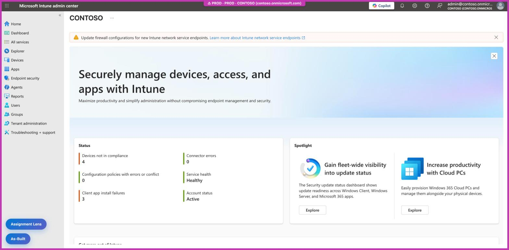

> **Two separate language settings.** The language of the **Intune admin center** (Settings > Language + region, or the 🌐 buttons of Set Tenant Language) and the language of **the extension** (FR / EN buttons in the menu) are set independently: changing one does not change the other. The screenshots in this document show both the portal **and** the extension in English; the [French version](README.md) shows both in French.

> **About the screenshots.** They are taken in a real test tenant. The tenant name, domain, account and scope tags are anonymized (`contoso.onmicrosoft.com`, "Paris") in the page before each capture. The extension menu pages cannot be captured by the automation tool: they are rendered with the real `popup.html` code, in a local page, with fictitious data (Contoso, Fabrikam, Northwind).

## Contents

- [Features](#features)
- [Installation](#installation)
- [Data and privacy](#data-and-privacy)
- [Menu](#menu)
- [Tenant Guard](#tenant-guard)
- [As-Built](#as-built-panel-in-the-portal)
- [Assignment Lens](#assignment-lens)
- [Setting Inspector](#setting-inspector)
- [Settings Explainer](#settings-explainer)
- [OpenIntuneBaseline](#openintunebaseline)
- [Change Snapshot](#change-snapshot)
- [Set Tenant Language](#set-tenant-language)
- [PIM shortcut](#pim-shortcut)
- [Moving panels](#moving-panels)
- [How it works](#how-it-works)
- [Limitations](#limitations)
- [Tests](#tests)

## Features

| Feature | What it does | Where |
|---|---|---|
| Tenant Guard | Pill and colored frame for the active tenant; confirmation before Save, Delete, Assign, Create, Wipe, Retire in a PROD tenant | Intune, Entra, Azure, Defender, M365, Purview, Exchange, Teams, SharePoint admin consoles (see [Supported consoles](#supported-consoles)) |
| One-click As-Built | Exports the selected policies to Markdown, Word and JSON, scripts included. Intune and Entra (Conditional Access, authentication, mobility) | Button at the bottom left (Intune, Entra, Azure) |
| Setting Inspector | Card on setting hover, details section: definition ID, OMA-URI / key, applicability, license, equivalent GPO, Learn links | Card on the right edge, on setting hover |
| Settings Explainer | Same card, explanation section: written text, live Learn page, values, default. Can be used on its own | Same card |
| OpenIntuneBaseline | Same card, OIB section: value set by the OpenIntuneBaseline community baseline and the policy concerned. Can be used on its own | Same card |
| Assignment Lens | Included / excluded groups, members, filters, overlaps of the displayed policy | Button above As-Built |
| Change Snapshot | Local change log: before / after diff, author, ticket number, JSON / CSV export | Window at the bottom right after a save; log from the menu |
| Set Tenant Language | Switches the console between two preset languages in one click | 🌐 buttons in the menu; Intune, Azure, Entra, Defender, Purview |
| PIM shortcut | Opens PIM > My roles (eligible or active assignments) on the active tab's tenant in one click | 🔑 PIM eligible and 🔑 PIM active buttons in the menu |

## Installation

1. Open `edge://extensions` (or `chrome://extensions`) and turn on **Developer mode**.
2. Click **Load unpacked** and select the `tenant-compass/` folder.
3. Turn off the standalone Tenant Guard, As-Built, Setting Inspector and Assignment Lens extensions if they are loaded, otherwise everything shows twice.
4. After updating the folder: click **↻** on the extension in `edge://extensions`, then reload the portal tab.

## Data and privacy

**No data is sent to any third party, nor to the extension's author.** No telemetry, no usage statistics, no server of its own. Everything the extension reads, computes or stores stays in the browser. The only network traffic goes to Microsoft services the portal already uses:

| Feature | Network traffic | Content |
|---|---|---|
| As-Built, Assignment Lens | Reads (`GET`) on `graph.microsoft.com`, with the portal session | The policies, apps and groups shown, as the portal itself does |
| Settings Explainer | Cookie-less reads of public `learn.microsoft.com/…/windows/client-management/mdm/` pages | No tenant data: only the name of the documentation page requested |
| Tenant Guard, Setting Inspector, OpenIntuneBaseline, Change Snapshot, Set Tenant Language, PIM shortcut | None | They observe the page and the responses the portal already receives |

- **Token**: the portal token is never stored, logged or sent to the service worker. Change Snapshot only keeps the author (`upn`) and the tenant ID (`tid`).
- **Local storage**: settings, known tenants and colors in `chrome.storage.sync`; captured definitions, the Learn page cache and the Change Snapshot log in `chrome.storage.local`; panel positions in the portal's `localStorage`. Details in [ARCHITECTURE.md](ARCHITECTURE.md), section 8.
- **Browser sync**: `chrome.storage.sync` follows the Edge or Chrome profile sync. When it is on, the settings and known tenants are copied to your other devices by the browser itself, like your favorites. The Change Snapshot log and captured definitions stay on the device.

## Menu

Click the extension icon. On the left, the **🌐 FR / 🌐 EN** column switches the console between the two preset languages ([Set Tenant Language](#set-tenant-language)); on the right, the active feature pills (description on hover, 📋 opens the Change Snapshot log). Below, the purple **🔑 PIM eligible** and **🔑 PIM active** buttons ([PIM shortcut](#pim-shortcut)). When Tenant Guard is on, the tenant detected in the tab and the list of known tenants can be edited right there.

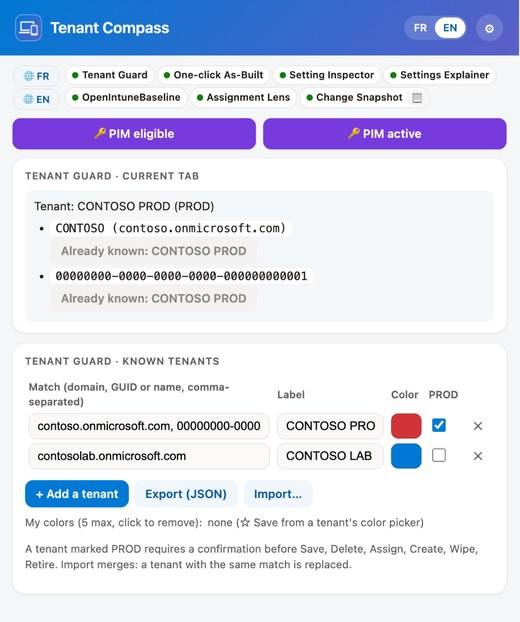

| Settings (⚙), features | Settings (⚙), continued |
|---|---|
| 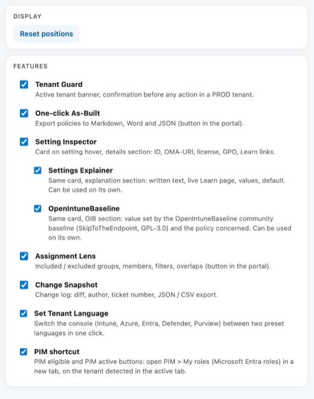 | 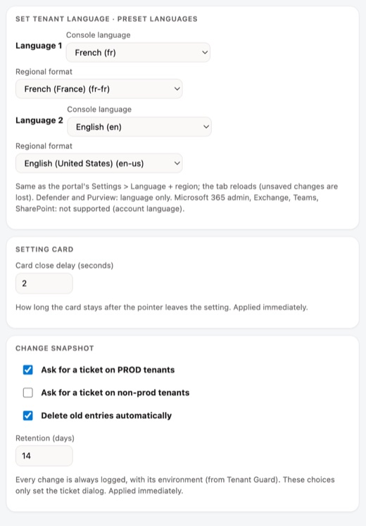 |

*Menu rendered with the actual `popup.html` code and fictitious tenants (Contoso): the extension page cannot be captured by the automation tool.*

- **FR / EN** (header): extension language, French (FR) or English (US): menu, portal panels and cards, confirmation dialogs, log, As-Built export headings. Stored in the browser profile; defaults to the browser language. In the portal, the language applies when the tab reloads. It does **not** change the portal's own language.
- **Blue "Reload the portal tab to apply (features and language) ↻" button**: appears after turning a feature on or off, or changing the language.
- **📋** (in the Change Snapshot pill): opens the change log.
- **⚙ Settings** (open under the pills):
  - **Display**: **Reset positions** moves the buttons and panels back to the bottom left.
  - **Features**: one checkbox per feature, with its description. A cleared feature injects no script at all. **Settings Explainer** and **OpenIntuneBaseline** are indented under Setting Inspector: they are the three sections of the same setting card, each usable on its own, independent of each other.
  - **Set Tenant Language · preset languages**: Language 1 and Language 2 (console language and regional format), applied by the two 🌐 buttons of the left column.
  - **Setting card**: card close delay (Setting Inspector, Settings Explainer, OpenIntuneBaseline), in seconds (2 by default, 0 to 60), applied without reloading the portal.
  - **Change Snapshot**: ticket request on PROD / non-prod tenants, automatic deletion of old entries and retention (see [Change Snapshot](#change-snapshot)).
- **Tenant Guard · known tenants** (main view): match, label, color, PROD.
  - **Export (JSON)**: downloads `tenant-guard-YYYY-MM-DD.json` (`{ rules: [{ match, label, color, prod }], customColors: ["#rrggbb"] }`).
  - **Color**: see [Tenant Guard](#tenant-guard).
  - **Import…**: merges an exported file; a tenant with the same match is replaced (label and color included), "My colors" are merged (5 at most). From the menu, the button opens the options page in a tab (the menu closes when the file picker opens).

## Tenant Guard

Pill at the top of the page (label of the known tenant) and a frame in the chosen color around the portal (see the [overview](#tenant-compass)). In a tenant marked PROD, sensitive actions (Save, Delete, Assign, Create, Wipe, Retire) are blocked until confirmed. **Cancel** has the focus by default; Esc cancels.

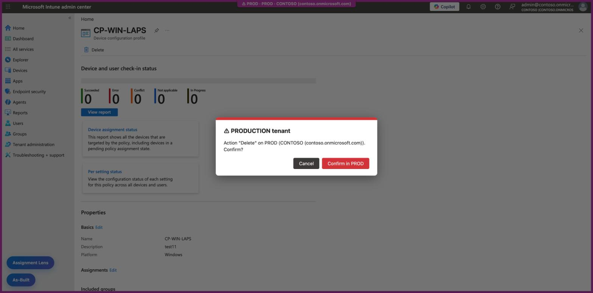

**Tenant color** (menu, Color column): row 1, the 5 preset colors; row 2, "My colors" (5 at most); below, hue / lightness sliders and a `#RRGGBB` code with a preview (click the preview or press Enter to apply). **☆ Save** adds the current color to "My colors". **Other…** opens the native color picker in the options page (the native picker would close the menu).

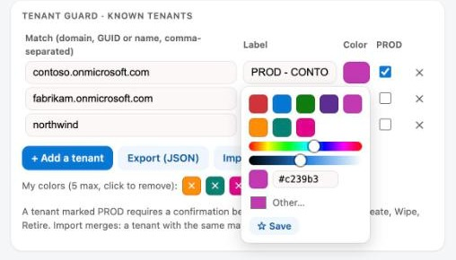

### Supported consoles

Admin consoles only: nothing is injected into end-user pages (Outlook, Teams, SharePoint sites, Power BI…). Tested on 2026-10-04 (tenant detection, pill, frame).

| Console | Address | Tested |
|---|---|---|
| Intune | `intune.microsoft.com` (and `endpoint.microsoft.com`, redirected) | ✅ |
| Entra | `entra.microsoft.com` (and `aad.portal.azure.com`, redirected) | ✅ |
| Azure | `portal.azure.com` | ✅ |
| Defender | `security.microsoft.com` | ✅ |
| Microsoft 365 admin center | `admin.cloud.microsoft` (and `admin.microsoft.com`, redirected) | ✅ |
| Exchange | `admin.cloud.microsoft/exchange` (and `admin.exchange.microsoft.com`) | ✅ |
| Purview | `purview.microsoft.com` (and `compliance.microsoft.com`, redirected) | ✅ |
| Teams | `admin.teams.microsoft.com` | ✅ |
| SharePoint | `<tenant>-admin.sharepoint.com` | ✅ |

Not supported: Power Platform, Power BI / Fabric.

Tenant detection, by priority: URL (`tid=`, `tenantId=`, `ctid=`, `#@domain`), directory name shown in the header, keys of the page's MSAL cache (only when a single tenant is found there). To add a tenant: menu, *Current tab*, **Add** button next to the detected identifier. A tenant added by its name (e.g. `contoso.onmicrosoft.com`) learns its tenant ID on the first visit to Intune, Entra or Azure: it is then also recognized in the consoles that only expose the ID (Defender, Microsoft 365 admin center).

## As-Built (panel in the portal)

**As-Built** button at the bottom left. The panel lists the tenant's policies and apps, with their type and platform.

| Panel | Selecting policies |
|---|---|
| 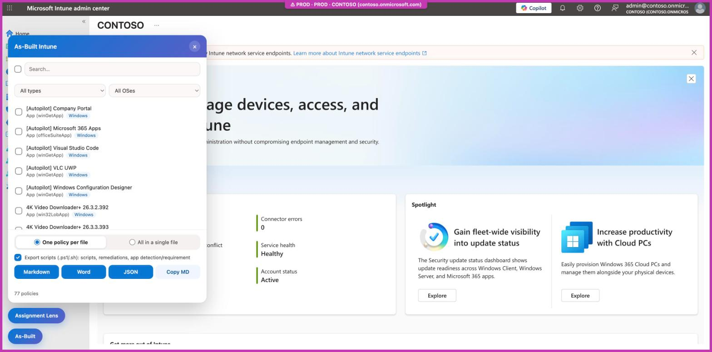 | 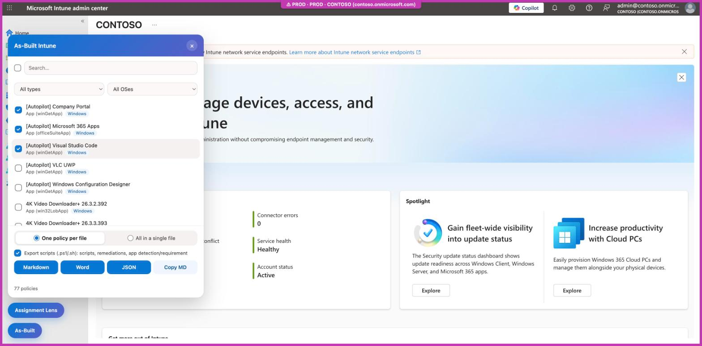 |

- Sources (Intune console): settings catalog, configuration profiles, compliance, ADMX, apps, PowerShell scripts, macOS shell scripts, remediations, Autopilot profiles, Autopilot devices, enrollment (Enrollment Status Page, restrictions, Windows Hello...), Apple ADE (DEP) profiles, Android Enterprise / AOSP enrollment profiles, tenant customization (branding profiles), Intune roles (RBAC, with their assignments: members, scope, tags), scope tags.
- Filters: search by name, type, OS. The checkbox at the top of the list checks or clears everything shown.
- **Open policy**: the one shown in the portal is placed at the top of the list, without being checked. Checked items then move up in the order they were checked; the list does not scroll when an item moves up.
- **Autopilot devices**: one item for the whole inventory, also exported as CSV (`autopilot-devices-<date>.csv`, `;` separator): serial number, manufacturer, model, group tag, user, profile and enrollment state. **The hardware hash (HWID) is not included**: Graph does not return it for a registered device, so the file cannot be imported back into Autopilot.
- **Masked secrets**: Android enrollment token and QR code content, Surface Hub account password, product key. Images (logos, QR code) are not exported.
- **Entra console** (`entra.microsoft.com`, `portal.azure.com`): **As-Built Entra** panel, another list: Conditional Access, named locations, authentication strengths, authentication methods (one row per method), MDM and MAM automatic enrollment (mobility). The Entra portal's Graph token carries `Policy.Read.All`, which the Intune portal's does not: these objects are listed from Entra or Azure only.
- **Conditional Access**: state (on, off, report-only), conditions, grant and session controls; included / excluded users, groups and roles in the **Assignments** table. IDs are replaced by names (users, groups, roles, apps, locations) and keywords spelled out ("All", "All trusted locations"...). Document titled "Detailed Design Document – Microsoft Entra", file `as-built-entra-<date>`. Read-only, with the signed-in account's rights.
- Export mode: **One policy per file** (default) or all policies in a single file. **Copy MD** always copies a single Markdown block.
- **Export scripts** (checked by default): downloads next to the document, decoded from Graph's Base64 (`.ps1` / `.sh`), the scripts, remediations (detection + remediation) and the PowerShell detection / requirement scripts of Win32 apps.
- `.intunewin` files cannot be exported: Graph exposes no download URL for published app content (the storage URI only exists during upload, and the content is encrypted).

## Assignment Lens

**Assignment Lens** button at the bottom left, just above As-Built. On an open policy or app, the card shows the included and excluded groups, member counts, filters, virtual targets (All users, All devices) and overlaps with other policies of the same family. ↻ refreshes; × or a click on the title closes the card. Drag the card by its header to move it.

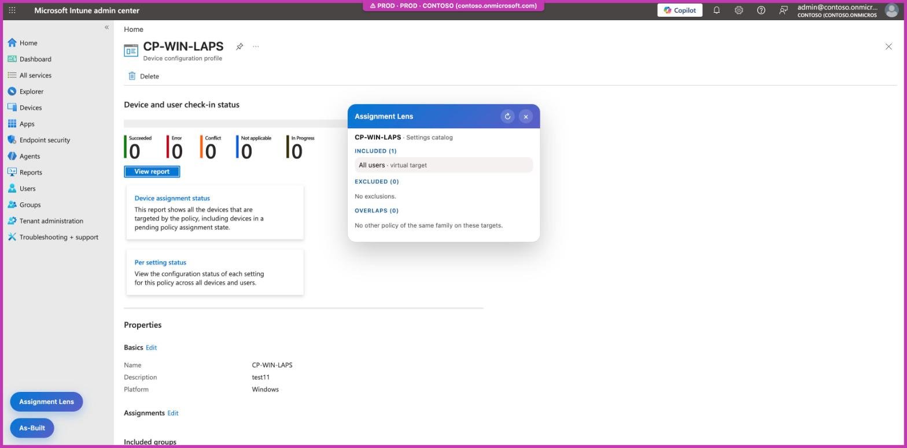

## Setting Inspector

On setting hover (settings catalog, endpoint security, policy editor or summary): a card on the right edge of the window. It gathers three sections toggled separately in ⚙: Setting Inspector (details, below), [Settings Explainer](#settings-explainer) (explanation) and [OpenIntuneBaseline](#openintunebaseline). The Setting Inspector section gives the definition ID, the OMA-URI (Windows) or key (macOS / iOS), applicability, the license and the equivalent GPO (`data/overlay.json`), and the Microsoft Learn links. The setting is recognized by its ID, read from the page's model: it works whatever the portal language.

Data (`setting-inspector/data/`):

- `settings.json`: Graph definitions indexed by normalized name. The shipped base only holds 12 settings; the others are captured while browsing (the portal's Graph responses, kept in `chrome.storage.local`, key `explainerLive`).
- `overlay.json`: license and equivalent GPO, which Graph does not expose. Merged at run time: edit the file, then reload the extension.

Rebuild the full base (Node 18+, no dependency, account with `DeviceManagementConfiguration.Read.All`):

```sh
az login
export GRAPH_TOKEN=$(az account get-access-token --resource-type ms-graph --query accessToken -o tsv)
node setting-inspector/tools/build-db.mjs   # from tenant-compass/, overwrites data/settings.json
```

Extending the overlay: for an ADMX-backed Policy CSP setting, copy the **Group policy mapping** table of the CSP's Learn page. Only enter verified values:

```json
"device_vendor_msft_policy_config_defender_allowarchivescanning": {
  "gpo": {
    "path": "Computer Configuration > Administrative Templates > Windows Components > Microsoft Defender Antivirus > Scan",
    "name": "Scan archive files",
    "admx": "WindowsDefender.admx",
    "registry": "HKLM\\Software\\Policies\\Microsoft\\Windows Defender\\Scan\\DisableArchiveScanning"
  }
}
```

License rules: see `setting-inspector/LICENSE-RULES-MAINTENANCE.md`.

## Settings Explainer

Section of the setting card (indented toggle under Setting Inspector in ⚙), usable on its own. On setting hover, the card **explains** the setting before the Setting Inspector details (when on). The card always sits on the right edge of the window, at the height of the hovered row, and stays for the delay set in ⚙ after the pointer leaves the setting (so you can hover it, scroll it, open its sections and click its links).

It combines three levels of information:

| Level | Content | Source |
|---|---|---|
| 1 | Description and help text, possible values, default, risk level | The setting definition the portal already loads |
| 2 | Learn description (in French when the French page exists and the extension is in French), Microsoft notes (yellow box), allowed range, GPO and registry | The CSP's Learn page, read live by the extension |
| 3 | What the setting really does, effect on the device and the user, pitfalls, recommendation, sources (**Explained** badge) | `settings-explainer/data/explain.json`, written and checked against Learn |

**Levels 1 and 2** (setting without a written explanation): Learn description, default value, allowed range, link to the source page.

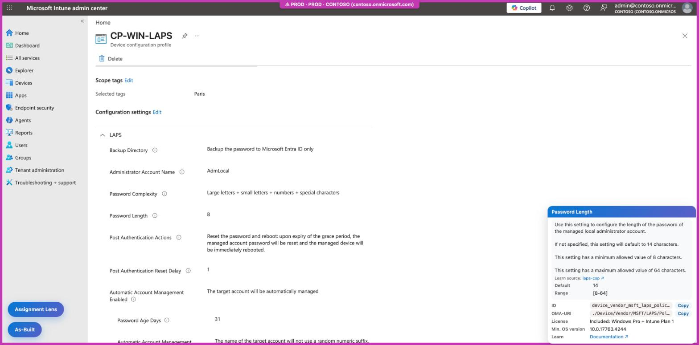

**Level 3**: the written explanation comes first. The Microsoft description is collapsed, and the card ends with the possible values and the Setting Inspector details (ID, OMA-URI, license, OS version, GPO and ADMX, documentation).

| Written explanation | Possible values and details |
|---|---|
| 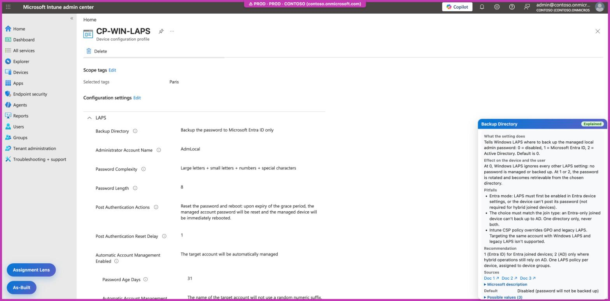 | 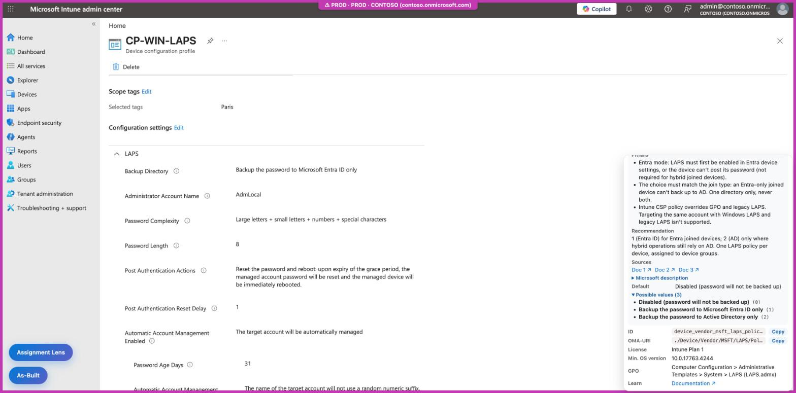 |

Explanations shipped (12 settings, FR and EN, checked against Learn by an independent review): Defender (archive scanning, real-time protection, cloud protection), Windows Update (`AllowAutoUpdate`), telemetry, Cortana, camera, `DevicePasswordEnabled`, BitLocker `RequireDeviceEncryption`, LAPS (`BackupDirectory`, `PasswordAgeDays`), Windows Hello for Business (`UsePassportForWork`). Variants of the same setting in templates (for example `…_passwordagedays_aad`) reuse the base setting's explanation.

The Learn page is read without cookies, only on `learn.microsoft.com/…/windows/client-management/mdm/`, and cached for 7 days. No tenant data is sent.

Adding an explanation: an entry in `explain.json`, under the setting ID, with `fr` and `en` (`what`, `impact`, `pitfalls`, `recommendation`, `sources`). `test.js` checks the ID, both languages and the sources. Only write one for settings with pitfalls (interactions, Intune context, a reasoned recommendation): for the others, the Learn page is enough.

## OpenIntuneBaseline

Third section of the setting card (indented toggle under Setting Inspector in ⚙), usable on its own. When the [OpenIntuneBaseline](https://openintunebaseline.com/) community baseline (OIB, SkipToTheEndpoint) configures the hovered setting, the card shows at the top the value set by OIB and the name of the OIB policy that sets it, with an `OIB` badge in the title. Otherwise: "Not configured by OpenIntuneBaseline". The link uses the exact setting ID (`settingDefinitionId`): it works whatever the portal language, and a choice value shows with the portal's label (in French when the portal is).

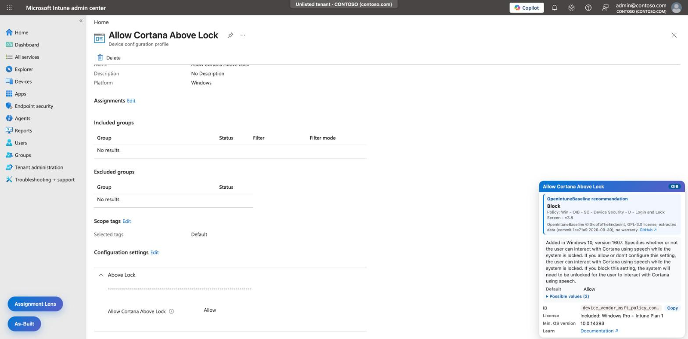

When the setting is recognized by its name (page text, without its option list), the OIB value is labeled with the allowed values of the CSP's Learn page: "Not allowed (0)" rather than "0".

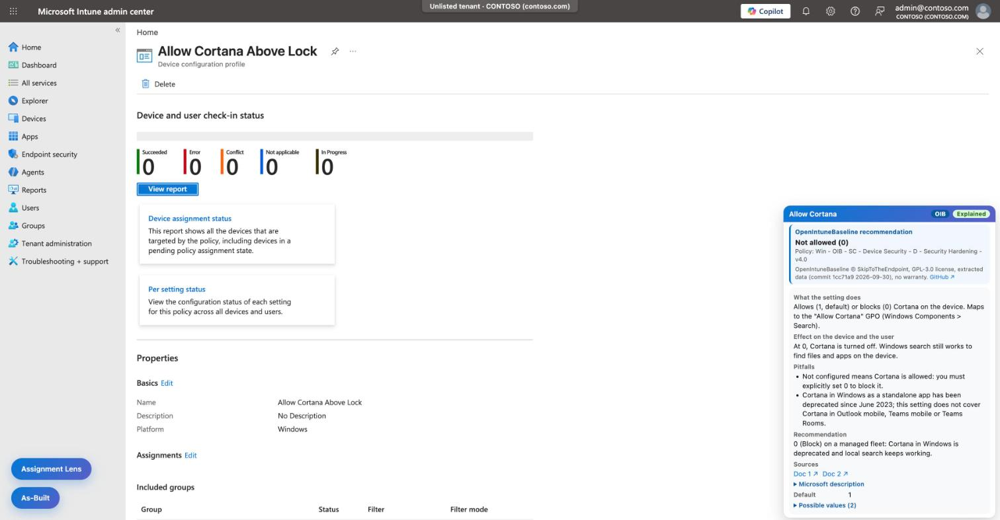

OIB is an author's baseline (inspired by CIS, NCSC and other frameworks), not a compliance standard: each organization decides which settings fit, and policies must be tested before deployment.

Data: `setting-inspector/data/oib.json` (80 Settings Catalog policies: Windows v4.0, macOS and Windows 365, 1,602 settings), built from the OIB repository (Node 18+, no dependency):

```sh
git clone --depth 1 https://github.com/SkipToTheEndpoint/OpenIntuneBaseline.git /tmp/oib
node setting-inspector/tools/build-oib.mjs /tmp/oib   # from tenant-compass/, overwrites data/oib.json
```

License: OpenIntuneBaseline is under **GPL-3.0**. `oib.json` is a modified version (extraction) distributed under the same license; the rest of Tenant Compass keeps its own license. Credit, changes, source and no-warranty statement: `setting-inspector/data/OIB-NOTICE.md`; license text: `setting-inspector/data/OIB-LICENSE.txt`. The card shows the author, the license and a link to the source. After an update, report the commit and date in `OIB-NOTICE.md`.

## Change Snapshot

Tracks policy changes made in the portal. When a policy is opened, the extension keeps its state; after a successful save, a window at the bottom right shows the diff and asks for a ticket number and a comment. The entry is saved even without a ticket (marked **no ticket**). The log (📋 in the menu) can be filtered by policy, user and date, and exported to JSON and CSV (`;` separator).

Each entry carries the environment detected by Tenant Guard (**PROD** or **non-prod**, `?` when the tab is not classified). In ⚙ Settings, **Change Snapshot** card:

- **Ask for a ticket on PROD tenants** (on by default) and **on non-prod tenants** (off by default): the change is always logged, only the ticket window changes. Unclassified tab: the window shows.
- **Delete old entries automatically** (on by default) and **Retention (days)** (14 by default, 1 to 3650): purge when the service worker wakes up, so on every portal visit. Export the log first if you need to keep it.

- Author and tenant read from the portal token (decoding only); the token is never stored. Secret values are masked.
- Log local to the browser (`chrome.storage.local`, keys `e:<id>`): useful for traceability, not tamper-proof audit evidence.
- If the policy was not opened in the tab before the change, the diff starts from an empty state (flagged).

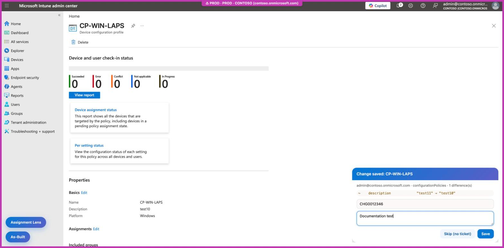

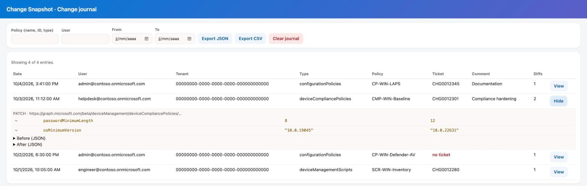

*The log is rendered with the real `journal.html` code and fictitious entries (Contoso): the extension page cannot be captured by the automation tool.*

The **Save** button of this window only writes to the local log: Tenant Guard does not ask for confirmation on Tenant Compass's own buttons.

Details (flow, covered endpoints, limitations), in French: [change-snapshot/README.md](change-snapshot/README.md).

## Set Tenant Language

Switches the console between **two preset languages** (Language 1, Language 2), without going through *Settings > Language + region*. In ⚙, choose for each the console language (the 24 languages of the Intune console) and the regional format (dates, numbers); by default, Language 1 = French, Language 2 = English. The menu then shows, stacked left of the active features, two buttons, **🌐 FR** and **🌐 EN** (per the chosen languages): one click reloads the active tab in that language, on the same page. This only changes the **console** language, not the extension's.

| Console | Mechanism | Tested on 2026-10-04 |
|---|---|---|
| Intune, Azure, Entra | `?l=<language>.<format>` (e.g. `?l=en.en-us`) | ✅ |
| Defender, Purview | `?mkt=<locale>` (e.g. `?mkt=en-us`), language only | ✅ |
| Microsoft 365 admin center, Exchange, Teams, SharePoint | no URL parameter changes the language: it follows the account language (*My account > Settings & Privacy*) | not supported |

- Observed portal behavior, not documented on Microsoft Learn: check on your tenant whether the language sticks after normal navigation.
- The reload loses unsaved changes in the tab.
- Code: `portal-language/lib.js` (tested: `node portal-language/test.js`).

## PIM shortcut

Two purple menu buttons (the Azure portal's PIM icon color, `#773adc`) open *Privileged Identity Management > My roles > Microsoft Entra roles* in a new tab:

- **🔑 PIM eligible**: *Eligible assignments* tab, to activate a role.
- **🔑 PIM active**: *Active assignments* tab, to see current roles, deactivate or extend them. No address opens this tab directly: the extension selects it once the page has loaded (the page's 2nd tab, whatever the portal language). If Microsoft asks to sign in again, the page opens on *Eligible assignments*.

When Tenant Guard has detected the active tab's tenant (tenant ID or `*.onmicrosoft.com` domain), PIM opens on **that** tenant (Azure `#@<tenant>/` prefix), not on the account's home tenant: useful for a consultant working on a customer tenant. Otherwise, PIM opens on the account's default tenant.

- Address: `https://portal.azure.com/#@<tenant>/view/Microsoft_Azure_PIMCommon/ActivationMenuBlade/~/aadmigratedroles`. Tested on 2026-10-04 (both buttons); observed portal behavior, not documented on Microsoft Learn.
- Code: `pim/lib.js` (tested: `node pim/test.js`), active tab selection in `background.js`.

## Moving panels

As-Built and Assignment Lens do not open at the same time: opening one collapses the other to its button.

The As-Built and Assignment Lens buttons and panels can be moved with the mouse (button: drag; panel: drag the header). The position is stored per element in the portal's `localStorage` (`tenant-compass:pos:*` keys), shared code in `shared/drag.js`. The **Reset positions** button in the menu clears these keys in the active tab and reloads it.

## How it works

`background.js` dynamically registers (`chrome.scripting.registerContentScripts`) the scripts of the checked features, based on the `chrome.storage.sync` key `features` (all on by default). Each feature lives in its own folder (`tenant-guard/`, `as-built/`, `setting-inspector/`, `settings-explainer/`, `assignment-lens/`, `change-snapshot/`, `portal-language/`), with a `lib.js` testable under Node and a `test.js`. The shared style (#0078d4 → #5b5fc7 gradient) and dragging (`shared/drag.js`) are common. Details: [ARCHITECTURE.md](ARCHITECTURE.md).

## Limitations

- Tenants added in the standalone Tenant Guard extension are not carried over: storage is per extension, they must be entered again.
- Assignment Lens only works on `intune.microsoft.com` (not `endpoint.microsoft.com`).
- OpenIntuneBaseline: the card shows a snapshot of the baseline (commit in `setting-inspector/data/OIB-NOTICE.md`), to rebuild at each OIB release; only Settings Catalog policies are included (not compliance or update policies).
- In a portal iframe, the setting card docks to the iframe's right edge, not the window's.
- Settings Explainer level 2 depends on the structure of the Learn pages; if it changes, the card keeps levels 1 and 3.
- Detection relies on the current structure of the portal and its Graph calls. The features were checked by hand in a test tenant (screenshots above), not by automated tests in the real portal.

## Tests

```
cd tenant-guard && node test.js
cd ../as-built && node test.js
cd ../setting-inspector && node test.js
cd ../settings-explainer && node test.js
cd ../assignment-lens && node test.js
cd ../change-snapshot && node test.js
cd ../portal-language && node test.js
```

## License

[PolyForm Noncommercial 1.0.0](LICENSE): free copying, modification and sharing for any noncommercial purpose, provided the "Required Notice" line (author name and source) is kept. Any commercial use needs written consent.

Exception: `setting-inspector/data/oib.json`, extracted from [OpenIntuneBaseline](https://github.com/SkipToTheEndpoint/OpenIntuneBaseline) (© SkipToTheEndpoint), is distributed under [GPL-3.0](setting-inspector/data/OIB-LICENSE.txt); credit, changes and source: [`OIB-NOTICE.md`](setting-inspector/data/OIB-NOTICE.md).
<!--⁣​​‌​‌​​​​​​‌​​‌​‍​⁣ -->
