# Tenant Compass

*Boîte à outils pour le portail Microsoft Intune.* · [English version](README.en.md)

Tenant Guard, As-Built en un clic, Setting Inspector, Settings Explainer, Assignment Lens, Change Snapshot et Set Tenant Language réunis dans une seule extension Chrome / Edge (Manifest V3). Chaque fonction s'active ou se désactive depuis le menu de l'extension. Aucune application à inscrire dans le tenant : l'extension réutilise la session Microsoft Graph du portail.

Architecture détaillée (scripts, flux, sécurité, stockage) : [ARCHITECTURE.md](ARCHITECTURE.md).

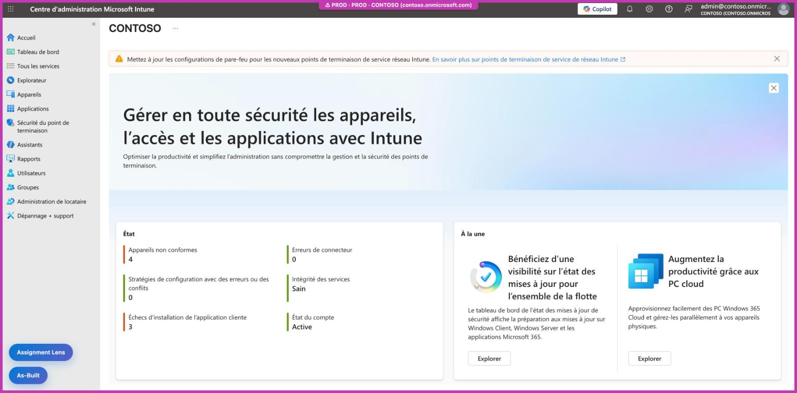

> **Deux réglages de langue distincts.** La langue du **portail Intune** (Paramètres > Langue + région, ou la pastille 🌐 de Set Tenant Language) et celle de **l'extension** (boutons FR / EN du menu) se règlent séparément : changer l'une ne change pas l'autre. Les captures de ce document sont prises avec le portail **et** l'extension en français ; la [version anglaise](README.en.md) les montre tous deux en anglais.

> **À propos des captures.** Elles sont prises dans un vrai tenant de test. Le nom du tenant, le domaine, le compte et les balises d'étendue sont anonymisés (`contoso.onmicrosoft.com`, « Paris ») avant chaque capture, directement dans la page. Les pages du menu de l'extension ne peuvent pas être capturées par l'outil d'automatisation : elles sont rendues avec le code réel de `popup.html`, dans une page locale, avec des données fictives (Contoso, Fabrikam, Northwind).

## Sommaire

- [Fonctions](#fonctions)
- [Installation](#installation)
- [Données et confidentialité](#données-et-confidentialité)
- [Menu](#menu)
- [Tenant Guard](#tenant-guard)
- [As-Built](#as-built-panneau-dans-le-portail)
- [Assignment Lens](#assignment-lens)
- [Setting Inspector](#setting-inspector)
- [Settings Explainer](#settings-explainer)
- [OpenIntuneBaseline](#openintunebaseline)
- [Change Snapshot](#change-snapshot)
- [Set Tenant Language](#set-tenant-language)
- [Déplacement](#déplacement)
- [Fonctionnement](#fonctionnement)
- [Limites](#limites)
- [Tests](#tests)

## Fonctions

| Fonction | Ce qu'elle fait | Où |
|---|---|---|
| Tenant Guard | Bandeau et cadre de couleur du tenant actif ; confirmation avant Enregistrer, Supprimer, Attribuer, Créer, Wipe, Retire dans un tenant PROD | Portails Intune, Entra, Azure, Defender, M365, Purview, Exchange, Teams |
| As-Built en un clic | Export des stratégies choisies en Markdown, Word et JSON, scripts compris | Bouton en bas à gauche |
| Setting Inspector | Carte au survol d'un paramètre du catalogue, section détails : identifiant, OMA-URI / clé, applicabilité, licence, GPO équivalente, liens Learn | Carte au bord droit, au survol d'un paramètre |
| Settings Explainer | Même carte, section explication : texte rédigé, page Learn lue en direct, valeurs, valeur par défaut. Activable seule | Même carte |
| OpenIntuneBaseline | Même carte, section OIB : valeur configurée par la baseline communautaire OpenIntuneBaseline et stratégie concernée. Activable seule | Même carte |
| Assignment Lens | Groupes inclus / exclus, membres, filtres, chevauchements de la stratégie affichée | Bouton au-dessus d'As-Built |
| Change Snapshot | Journal local des modifications : différence avant / après, auteur, n° de ticket, export JSON / CSV | Fenêtre en bas à droite après un enregistrement ; journal depuis le menu |
| Set Tenant Language | Passe la console dans une langue et un format régional prédéfinis, en 1 clic | Pastille 🌐 du menu |

## Installation

1. Ouvrir `edge://extensions` (ou `chrome://extensions`) et activer le **mode développeur**.
2. Cliquer sur **Charger l'extension décompressée** et choisir le dossier `tenant-compass/`.
3. Désactiver les extensions séparées Tenant Guard, As-Built, Setting Inspector et Assignment Lens si elles sont chargées, sinon tout s'affiche en double.
4. Après une mise à jour du dossier : bouton **↻** de l'extension dans `edge://extensions`, puis recharger l'onglet du portail.

## Données et confidentialité

**Aucune donnée n'est envoyée à un tiers, ni à l'auteur de l'extension.** Pas de télémétrie, pas de statistiques d'usage, pas de serveur propre. Tout ce que l'extension lit, calcule ou enregistre reste dans le navigateur. Les seuls échanges réseau partent vers des services Microsoft que le portail utilise déjà :

| Fonction | Échange réseau | Contenu |
|---|---|---|
| As-Built, Assignment Lens | Lectures (`GET`) sur `graph.microsoft.com`, avec la session du portail | Les stratégies, applications et groupes affichés, comme le fait le portail |
| Settings Explainer | Lecture sans cookie de pages publiques `learn.microsoft.com/…/windows/client-management/mdm/` | Aucune donnée du tenant : seulement le nom de la page de documentation demandée |
| Tenant Guard, Setting Inspector, OpenIntuneBaseline, Change Snapshot, Set Tenant Language | Aucun | Ils observent la page et les réponses que le portail reçoit déjà |

- **Jeton** : le jeton du portail n'est jamais enregistré, journalisé ni transmis au service worker. Change Snapshot n'en garde que l'auteur (`upn`) et l'identifiant du tenant (`tid`).
- **Stockage local** : réglages, tenants référencés et couleurs dans `chrome.storage.sync` ; définitions captées, cache des pages Learn et journal Change Snapshot dans `chrome.storage.local` ; positions des panneaux dans le `localStorage` du portail. Le détail est dans [ARCHITECTURE.md](ARCHITECTURE.md), section 8.
- **Synchronisation du navigateur** : `chrome.storage.sync` suit la synchronisation du profil Edge ou Chrome. Si elle est activée, les réglages et les tenants référencés sont copiés sur vos autres appareils par le navigateur lui-même, comme vos favoris. Le journal Change Snapshot et les définitions captées restent sur l'appareil.

## Menu

Clic sur l'icône de l'extension. Une ligne de pastilles montre les fonctions actives (description au survol, 📋 ouvre le journal de Change Snapshot, 🌐 applique la langue prédéfinie de la console). Si Tenant Guard est actif, le tenant détecté dans l'onglet et la liste des tenants référencés restent modifiables directement.

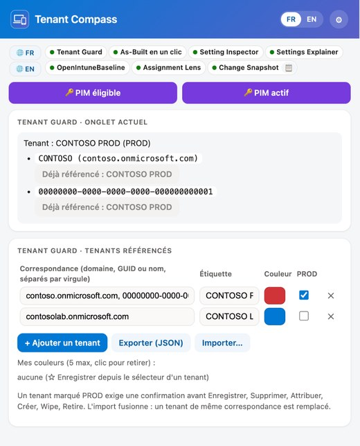

| Paramètres (⚙), fonctions | Paramètres (⚙), suite |
|---|---|
| 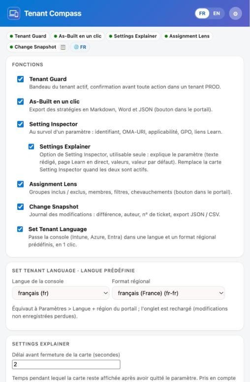 | 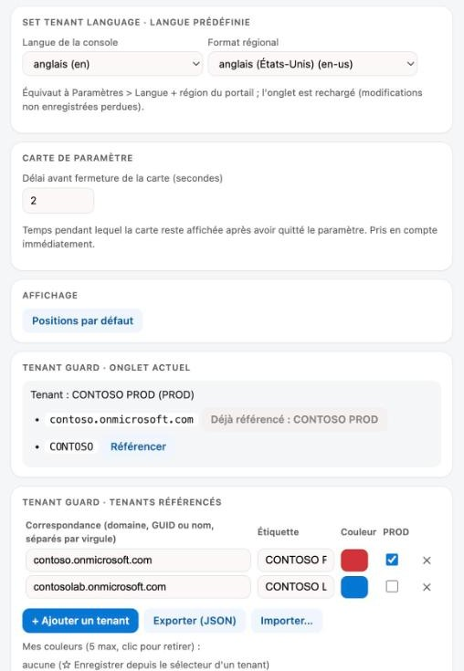 |

*Menu rendu avec le code réel de `popup.html` et des tenants fictifs (Contoso) : la page de l'extension ne peut pas être capturée par l'outil d'automatisation.*

- **FR / EN** (en-tête) : langue de l'extension, Français (FR) ou English (US) : menu, panneaux et cartes dans le portail, boîtes de confirmation, journal, intitulés des exports As-Built. Mémorisée dans le profil du navigateur ; par défaut, la langue du navigateur. Dans le portail, la langue s'applique au rechargement de l'onglet.
- **Bouton bleu « Recharger l'onglet du portail pour appliquer (fonctions et langue) ↻ »** : apparaît après une activation, une désactivation ou un changement de langue.
- **📋** (dans la pastille Change Snapshot) : ouvre le journal des modifications.
- **⚙ Paramètres** (s'ouvrent sous les pastilles) :
  - **Fonctions** : une case par fonction, avec sa description. Une fonction décochée n'injecte plus aucun script. **Settings Explainer** et **OpenIntuneBaseline** apparaissent en retrait sous Setting Inspector : ce sont les trois sections de la même carte de paramètre, chacune activable seule, sans lien entre elles.
  - **Set Tenant Language · langue prédéfinie** : langue de la console et format régional appliqués par la pastille 🌐.
  - **Carte de paramètre** : délai avant fermeture de la carte (Setting Inspector, Settings Explainer, OpenIntuneBaseline), en secondes (2 par défaut, de 0 à 60), pris en compte sans recharger le portail.
  - **Affichage** : **Positions par défaut** replace les boutons et panneaux en bas à gauche.
- **Tenant Guard · tenants référencés** (vue principale) : correspondance, étiquette, couleur, PROD.
  - **Exporter (JSON)** : télécharge `tenant-guard-AAAA-MM-JJ.json` (`{ rules: [{ match, label, color, prod }], customColors: ["#rrggbb"] }`).
  - **Couleur** : voir [Tenant Guard](#tenant-guard).
  - **Importer…** : fusionne un fichier exporté ; un tenant de même correspondance est remplacé (étiquette et couleur comprises), « Mes couleurs » sont fusionnées (5 au maximum). Depuis le menu, le bouton ouvre la page d'options en onglet (le menu se ferme quand le sélecteur de fichier s'ouvre).

Ajouter une langue : un dictionnaire dans `shared/i18n.js` (menu) et dans chaque `<fonction>/i18n.js` (mêmes clés), un fichier `shared/lang/<code>.js`, le code dans `LANGS` de `background.js` et un bouton `data-lang` dans `popup.html`.

## Tenant Guard

Pastille en haut de page (étiquette du tenant référencé) et cadre de la couleur choisie autour du portail (voir la [vue d'ensemble](#tenant-compass)). Dans un tenant marqué PROD, les actions sensibles (Enregistrer, Supprimer, Attribuer, Créer, Wipe, Retire) sont bloquées tant qu'elles ne sont pas confirmées. **Annuler** a le focus par défaut, Échap annule.

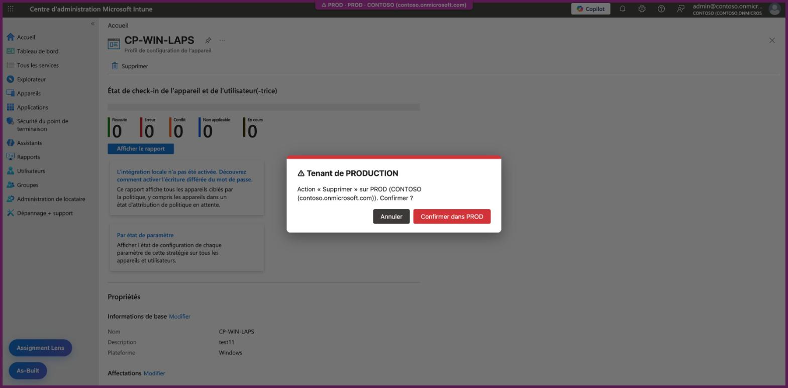

**Couleur d'un tenant** (menu, colonne Couleur) : ligne 1, les 5 couleurs prédéfinies ; ligne 2, « Mes couleurs » (5 au maximum) ; dessous, curseurs teinte / luminosité et code `#RRGGBB` avec aperçu (clic sur l'aperçu ou Entrée pour appliquer). **☆ Enregistrer** ajoute la couleur courante à « Mes couleurs ». **Autre…** ouvre le sélecteur natif dans la page d'options (le sélecteur natif fermerait le menu).

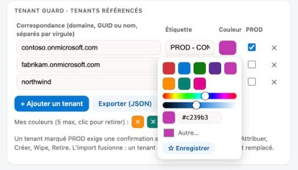

Détection du tenant, par ordre de priorité : URL (`tid=`, `tenantId=`, `ctid=`, `#@domaine`), nom de l'annuaire affiché dans l'en-tête, clés du cache MSAL de la page (seulement si un seul tenant y figure). Pour référencer un tenant : menu, *Onglet actuel*, bouton **Référencer** à côté de l'identifiant détecté.

## As-Built (panneau dans le portail)

Bouton **As-Built** en bas à gauche. Le panneau liste les stratégies et applications du tenant, avec leur type et leur plateforme.

| Panneau | Sélection de stratégies |
|---|---|
| 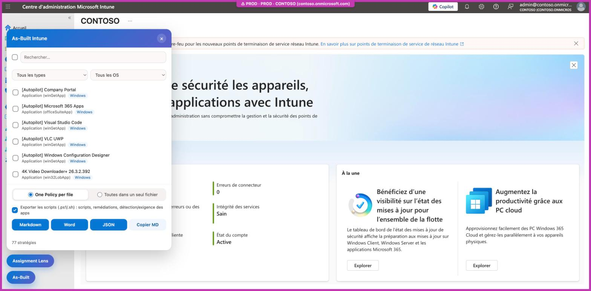 |  |

- Sources : catalogue de paramètres, profils de configuration, conformité, ADMX, applications, scripts PowerShell, scripts shell macOS, remédiations.
- Filtres : recherche par nom, type, OS. La case en tête de liste coche ou décoche tout ce qui est affiché.
- Mode d'export : **One policy per file** (défaut) ou toutes les stratégies dans un seul fichier. **Copy MD** copie toujours un seul bloc Markdown.
- **Export scripts** (coché par défaut) : télécharge à côté du document, décodés depuis le Base64 de Graph (`.ps1` / `.sh`), les scripts, remédiations (détection + correction) et scripts PowerShell de détection / exigence des applications Win32.
- Le fichier `.intunewin` n'est pas exportable : Graph n'expose aucune URL de téléchargement d'un contenu d'application publié (l'URI de stockage n'existe que pendant l'upload, et le contenu est chiffré).

## Assignment Lens

Bouton **Assignment Lens** en bas à gauche, juste au-dessus d'As-Built. Sur une stratégie ou une application ouverte, la carte montre les groupes inclus et exclus, le nombre de membres, les filtres, les cibles virtuelles (Tous les utilisateurs, Tous les appareils) et les chevauchements avec d'autres stratégies de la même famille. ↻ actualise ; × ou un clic sur le titre ferme la carte. La carte se déplace en glissant son en-tête.

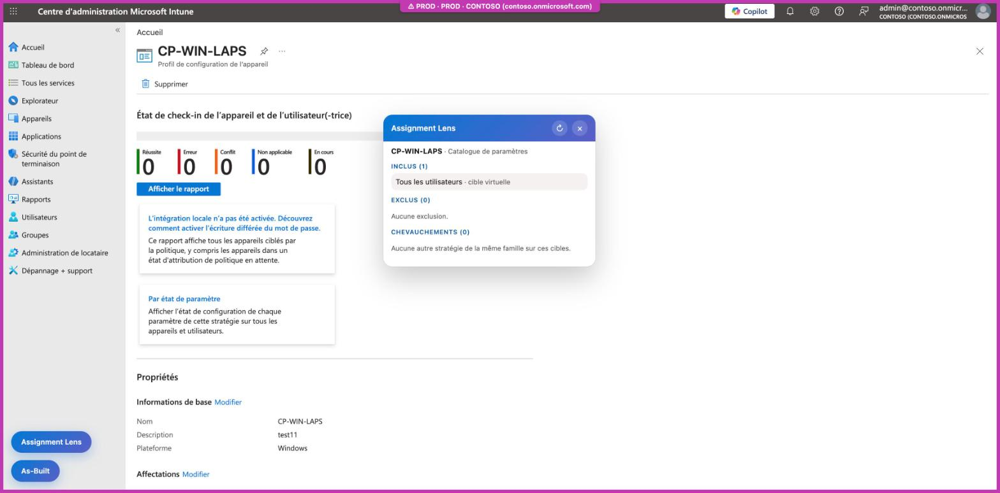

## Setting Inspector

Au survol d'un paramètre (catalogue de paramètres, sécurité du point de terminaison, éditeur ou résumé d'une stratégie) : carte contre le bord droit de la fenêtre. Elle réunit trois sections activables séparément dans ⚙ : Setting Inspector (détails, ci-dessous), [Settings Explainer](#settings-explainer) (explication) et [OpenIntuneBaseline](#openintunebaseline). La section Setting Inspector donne l'identifiant de définition, l'OMA-URI (Windows) ou la clé (macOS / iOS), l'applicabilité, la licence et la GPO équivalente (`data/overlay.json`), les liens Microsoft Learn. Le paramètre est reconnu par son identifiant, lu dans le modèle de la page : fonctionne quelle que soit la langue du portail.

Données (`setting-inspector/data/`) :

- `settings.json` : définitions Graph indexées par nom normalisé. La base fournie ne contient que 12 paramètres ; les autres sont capturés au fil de la navigation (réponses Graph du portail, gardées dans `chrome.storage.local`, clé `explainerLive`).
- `overlay.json` : licence et GPO équivalente, que Graph n'expose pas. Fusionné à l'exécution : modifier le fichier puis recharger l'extension.

Régénérer la base complète (Node 18+, sans dépendance, compte avec `DeviceManagementConfiguration.Read.All`) :

```sh
az login
export GRAPH_TOKEN=$(az account get-access-token --resource-type ms-graph --query accessToken -o tsv)
node setting-inspector/tools/build-db.mjs   # depuis tenant-compass/, écrase data/settings.json
```

Enrichir l'overlay : pour un paramètre Policy CSP basé sur un ADMX, reporter le tableau **Group policy mapping** de la page Learn du CSP. Ne renseigner que des valeurs vérifiées :

```json
"device_vendor_msft_policy_config_defender_allowarchivescanning": {
  "gpo": {
    "path": "Computer Configuration > Administrative Templates > Windows Components > Microsoft Defender Antivirus > Scan",
    "name": "Scan archive files",
    "admx": "WindowsDefender.admx",
    "registry": "HKLM\\Software\\Policies\\Microsoft\\Windows Defender\\Scan\\DisableArchiveScanning"
  }
}
```

Règles de licence : voir `setting-inspector/LICENSE-RULES-MAINTENANCE.md`.

## Settings Explainer

Section de la carte de paramètre (bascule en retrait sous Setting Inspector dans ⚙), activable seule. Au survol d'un paramètre, la carte **explique** le paramètre avant les détails de Setting Inspector (s'ils sont actifs). La carte est toujours contre le bord droit de la fenêtre, à la hauteur de la ligne survolée, et reste affichée le délai réglé dans ⚙ après la sortie du paramètre (on peut donc la survoler, la faire défiler, ouvrir ses sections et cliquer sur ses liens).

Elle combine trois niveaux d'information :

| Niveau | Contenu | Source |
|---|---|---|
| 1 | Description et aide, valeurs possibles, valeur par défaut, niveau de risque | Définition du paramètre que le portail charge déjà |
| 2 | Description Learn (en français quand la page française existe), notes Microsoft (encadré jaune), plage autorisée, GPO et registre | Page CSP Learn lue en direct par l'extension |
| 3 | Ce que fait vraiment le paramètre, effet sur le poste et l'utilisateur, pièges, recommandation, sources (badge **Expliqué**) | `settings-explainer/data/explain.json`, rédigé et vérifié sur Learn |

**Niveaux 1 et 2** (paramètre sans explication rédigée) : description Learn en français, valeur par défaut (et plage quand Learn la donne), lien vers la page source.

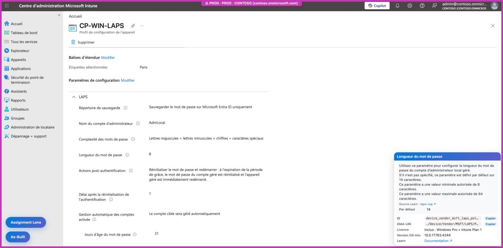

**Niveau 3** : l'explication rédigée passe en tête. La description Microsoft se replie, et la carte se termine par les valeurs possibles et les détails de Setting Inspector (ID, OMA-URI, licence, version OS, GPO et ADMX, documentation).

| Explication rédigée | Valeurs possibles et détails |
|---|---|
| 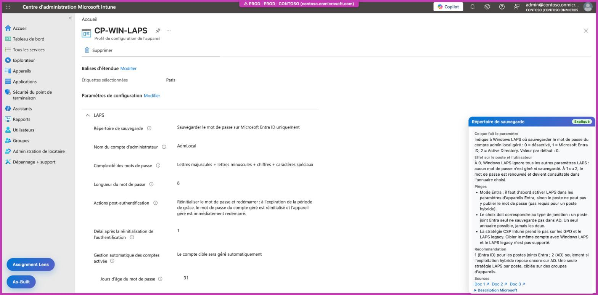 | 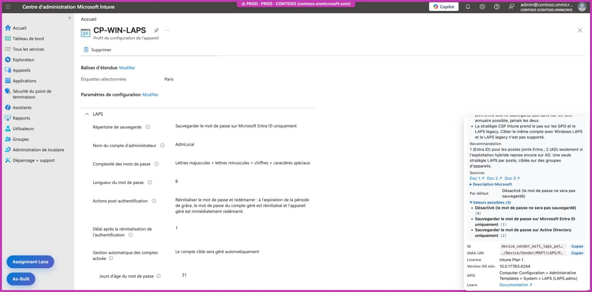 |

Explications livrées (12 paramètres, FR et EN, vérifiées sur Learn par une relecture indépendante) : Defender (analyse des archives, protection en temps réel, protection cloud), Windows Update (`AllowAutoUpdate`), télémétrie, Cortana, caméra, `DevicePasswordEnabled`, BitLocker `RequireDeviceEncryption`, LAPS (`BackupDirectory`, `PasswordAgeDays`), Windows Hello Entreprise (`UsePassportForWork`). Les variantes d'un même paramètre dans les modèles (par exemple `…_passwordagedays_aad`) reprennent l'explication du paramètre de base.

La page Learn est lue sans cookie, uniquement sur `learn.microsoft.com/…/windows/client-management/mdm/`, et gardée en cache 7 jours. Aucune donnée du tenant n'est envoyée.

Ajouter une explication : une entrée dans `explain.json`, sous l'ID du paramètre, avec `fr` et `en` (`what`, `impact`, `pitfalls`, `recommendation`, `sources`). `test.js` vérifie l'ID, les deux langues et les sources. Ne rédiger que pour les paramètres à pièges (interactions, contexte Intune, recommandation argumentée) : pour les autres, la page Learn suffit.

## OpenIntuneBaseline

Troisième section de la carte de paramètre (bascule en retrait sous Setting Inspector dans ⚙), activable seule. Si la baseline communautaire [OpenIntuneBaseline](https://openintunebaseline.com/) (OIB, SkipToTheEndpoint) configure le paramètre survolé, la carte affiche en tête la valeur retenue par OIB et le nom de la stratégie OIB qui la porte, avec un badge `OIB` dans le titre. Sinon : « Non configuré par OpenIntuneBaseline ». Le lien se fait par l'identifiant exact du paramètre (`settingDefinitionId`) : fonctionne quelle que soit la langue du portail, et une valeur à choix s'affiche avec le libellé du portail (en français si le portail l'est).

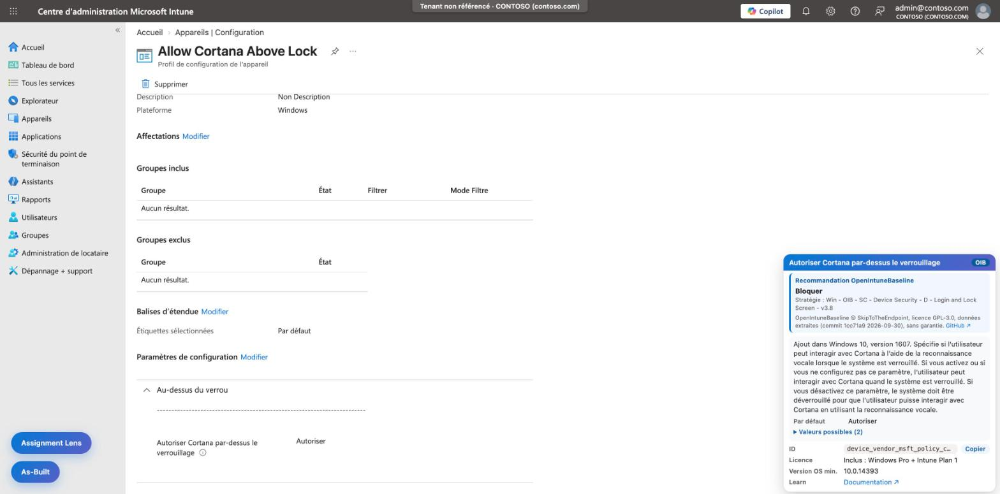

Quand le paramètre est reconnu par son nom (texte de la page, sans la liste de ses options), la valeur OIB est traduite avec les valeurs autorisées de la page Learn du CSP, en français quand elle existe : « Non autorisé (0) » plutôt que « 0 ».

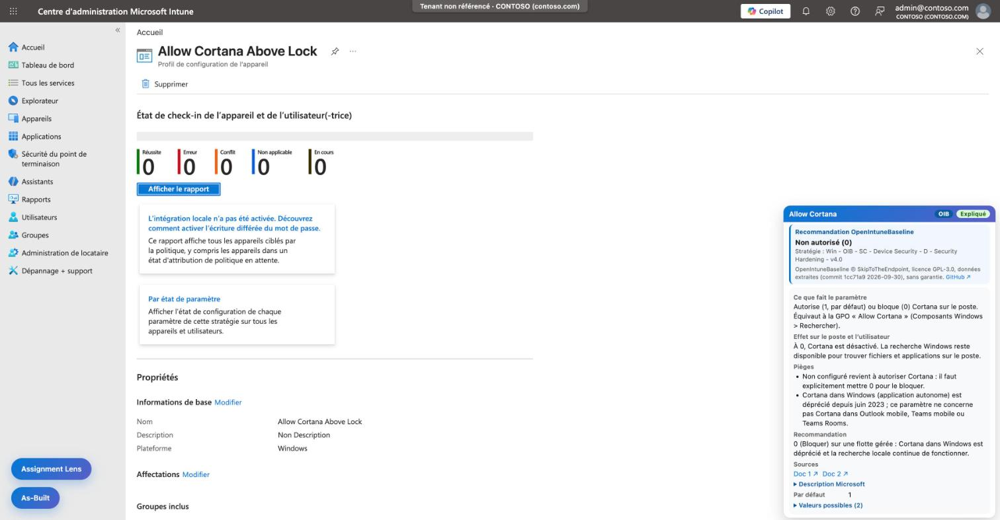

OIB est une baseline d'auteur (inspirée du CIS, du NCSC et d'autres référentiels), pas un standard de conformité : chaque organisation décide des paramètres qui lui conviennent, et les stratégies se testent avant déploiement.

Données : `setting-inspector/data/oib.json` (80 stratégies Settings Catalog Windows v4.0, macOS et Windows 365, 1 602 paramètres), produit depuis le dépôt OIB (Node 18+, sans dépendance) :

```sh
git clone --depth 1 https://github.com/SkipToTheEndpoint/OpenIntuneBaseline.git /tmp/oib
node setting-inspector/tools/build-oib.mjs /tmp/oib   # depuis tenant-compass/, écrase data/oib.json
```

Licence : OpenIntuneBaseline est sous **GPL-3.0**. `oib.json` est une version modifiée (extraction) distribuée sous la même licence ; le reste de Tenant Compass garde sa propre licence. Crédit, modifications, source et absence de garantie : `setting-inspector/data/OIB-NOTICE.md` ; texte de la licence : `setting-inspector/data/OIB-LICENSE.txt`. La carte rappelle l'auteur, la licence et le lien vers la source. Après une mise à jour, reporter le commit et la date dans `OIB-NOTICE.md`.

## Change Snapshot

Trace les modifications de stratégies faites dans le portail. À l'ouverture d'une stratégie, l'extension garde son état ; après un enregistrement réussi, une fenêtre en bas à droite montre la différence et demande un n° de ticket et un commentaire. L'entrée est enregistrée même sans ticket (marquée **sans ticket**). Le journal (📋 dans le menu) se filtre par stratégie, utilisateur et dates, et s'exporte en JSON et CSV (séparateur `;`).

- Auteur et tenant lus dans le jeton du portail (décodage seulement) ; le jeton n'est jamais enregistré. Les valeurs secrètes sont masquées.
- Journal local au navigateur (`chrome.storage.local`, clés `e:<id>`) : utile pour la traçabilité, pas une preuve d'audit infalsifiable.
- Si la stratégie n'a pas été ouverte dans l'onglet avant la modification, la différence part de zéro (signalé).

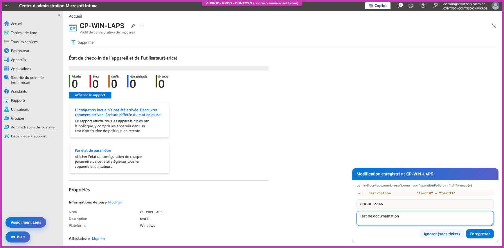

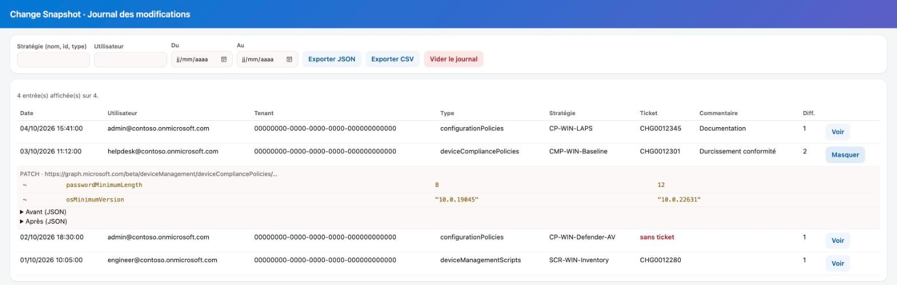

*Le journal est rendu avec le code réel de `journal.html` et des entrées fictives (Contoso) : la page de l'extension ne peut pas être capturée par l'outil d'automatisation.*

Le bouton **Enregistrer** de cette fenêtre n'écrit que dans le journal local : Tenant Guard ne demande pas de confirmation pour les boutons de Tenant Compass lui-même.

Détails (flux, points de terminaison couverts, limites) : [change-snapshot/README.md](change-snapshot/README.md).

## Set Tenant Language

Raccourci pour *Paramètres > Langue + région* du portail : choisir une fois, dans ⚙, la langue de la console (24 langues de la console Intune) et le format régional (dates, nombres) ; ensuite, un clic sur la pastille **🌐** du menu (visible sur la [capture du menu](#menu)) recharge l'onglet Intune, Azure ou Entra actif dans cette langue, sur la même page.

- Mécanisme : paramètre d'URL `l=<langue>.<format>` du portail (ex. `?l=en.en-us`). Comportement observé du portail, non documenté sur Microsoft Learn : vérifier sur votre tenant si la langue reste appliquée après une navigation normale.
- Le rechargement perd les modifications non enregistrées de l'onglet.
- Code : `portal-language/lib.js` (testé : `node portal-language/test.js`).

## Déplacement

As-Built et Assignment Lens ne s'ouvrent pas en même temps : ouvrir l'un réduit l'autre en bouton.

Les boutons et panneaux d'As-Built et d'Assignment Lens se déplacent à la souris (bouton : glisser ; panneau : glisser l'en-tête). Position mémorisée par élément dans le `localStorage` du portail (clés `tenant-compass:pos:*`), code commun dans `shared/drag.js`. Bouton **Positions par défaut** dans le menu : efface ces clés dans l'onglet actif et le recharge.

## Fonctionnement

`background.js` enregistre dynamiquement (`chrome.scripting.registerContentScripts`) les scripts des fonctions cochées, d'après `chrome.storage.sync` clé `features` (toutes actives par défaut). Chaque fonction vit dans son dossier (`tenant-guard/`, `as-built/`, `setting-inspector/`, `settings-explainer/`, `assignment-lens/`, `change-snapshot/`, `portal-language/`), avec un `lib.js` testable sous Node et un `test.js`. Le style commun (dégradé #0078d4 → #5b5fc7) et le déplacement (`shared/drag.js`) sont partagés. Détails : [ARCHITECTURE.md](ARCHITECTURE.md).

## Limites

- Les tenants référencés dans l'extension Tenant Guard séparée ne sont pas repris : le stockage est propre à chaque extension, il faut les ressaisir.
- Assignment Lens ne fonctionne que sur `intune.microsoft.com` (pas `endpoint.microsoft.com`).
- OpenIntuneBaseline : la carte montre un instantané de la baseline (commit dans `setting-inspector/data/OIB-NOTICE.md`), à régénérer à chaque version OIB ; seules les stratégies Settings Catalog sont reprises (pas les stratégies de conformité ni de mise à jour).
- Dans une iframe du portail, la carte de paramètre s'ancre au bord droit de l'iframe, pas de la fenêtre.
- Le niveau 2 de Settings Explainer dépend de la structure des pages Learn ; si elle change, la carte garde les niveaux 1 et 3.
- La détection repose sur la structure actuelle du portail et des appels Graph. Les fonctions ont été vérifiées à la main dans un tenant de test (captures ci-dessus), pas par des tests automatisés dans le vrai portail.

## Tests

```
cd tenant-guard && node test.js
cd ../as-built && node test.js
cd ../setting-inspector && node test.js
cd ../settings-explainer && node test.js
cd ../assignment-lens && node test.js
cd ../change-snapshot && node test.js
cd ../portal-language && node test.js
```

## Licence

[PolyForm Noncommercial 1.0.0](LICENSE) : copie, modification et partage gratuits autorisés pour tout usage non commercial, à condition de conserver la ligne « Required Notice » (nom de l'auteur et source). Tout usage commercial demande un accord écrit.

Exception : `setting-inspector/data/oib.json`, extrait d'[OpenIntuneBaseline](https://github.com/SkipToTheEndpoint/OpenIntuneBaseline) (© SkipToTheEndpoint), est distribué sous [GPL-3.0](setting-inspector/data/OIB-LICENSE.txt) ; crédit, modifications et source : [`OIB-NOTICE.md`](setting-inspector/data/OIB-NOTICE.md).
<!--⁣​​‌​‌​​​​​​‌​​‌​‍​⁣ -->
