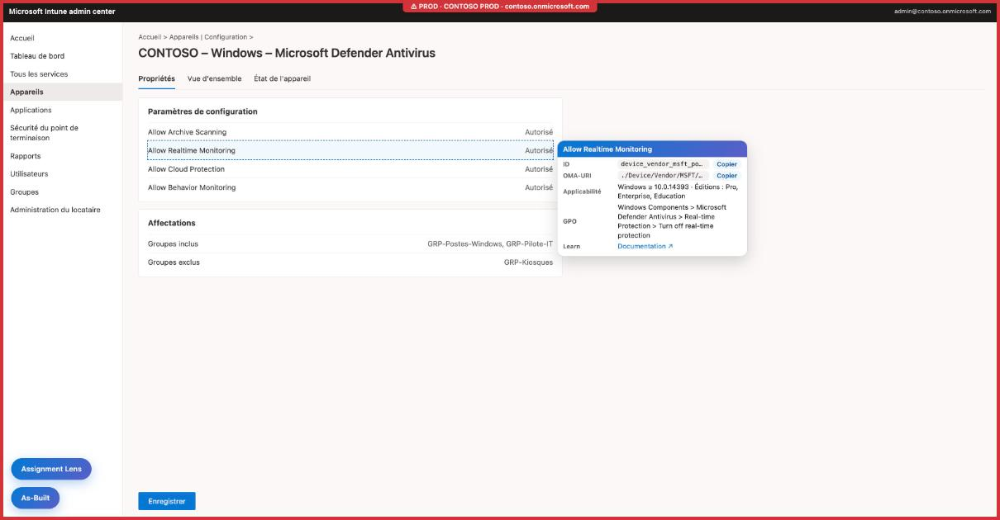
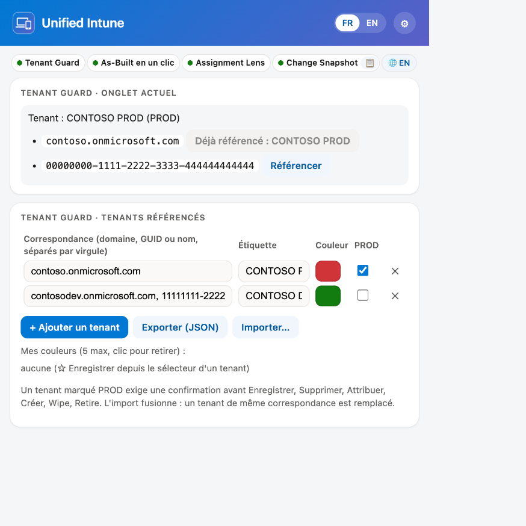
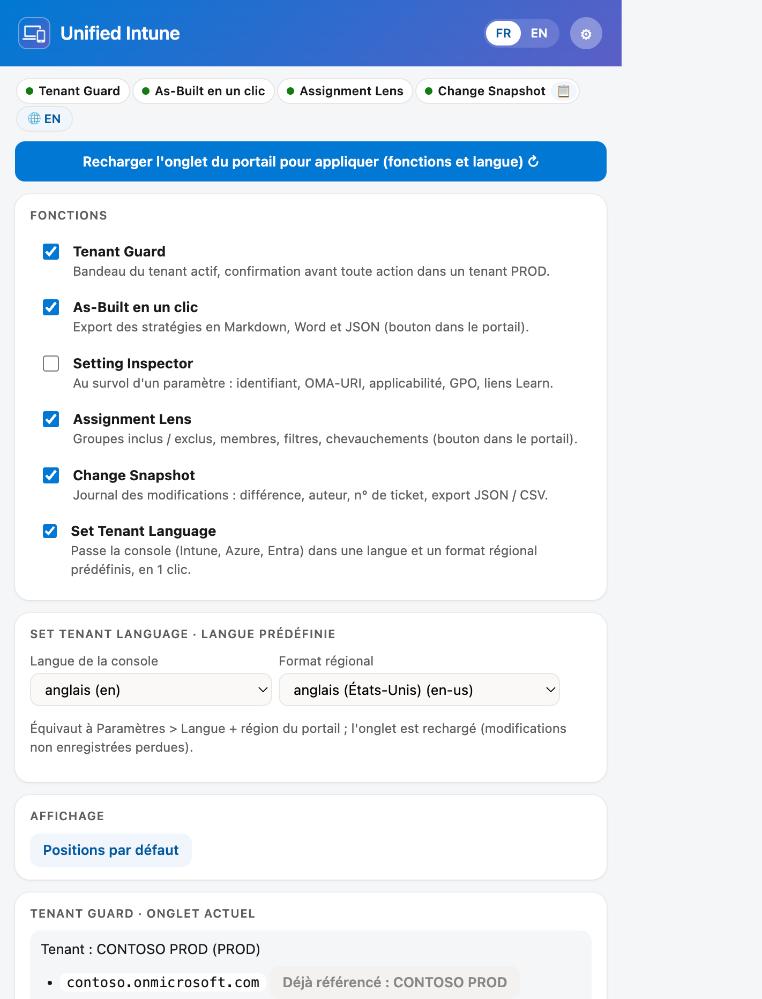
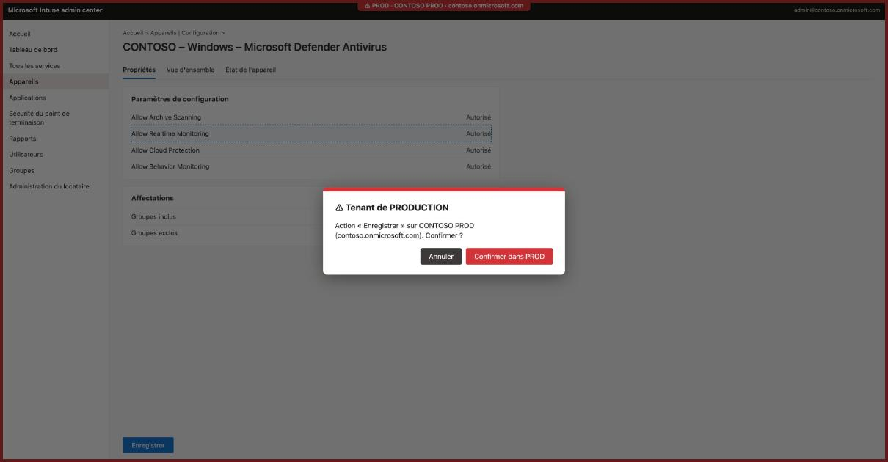
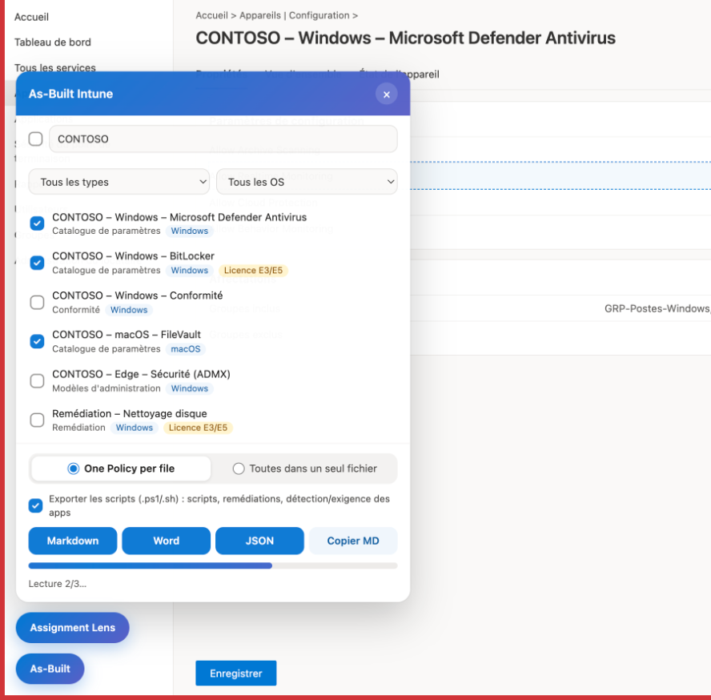
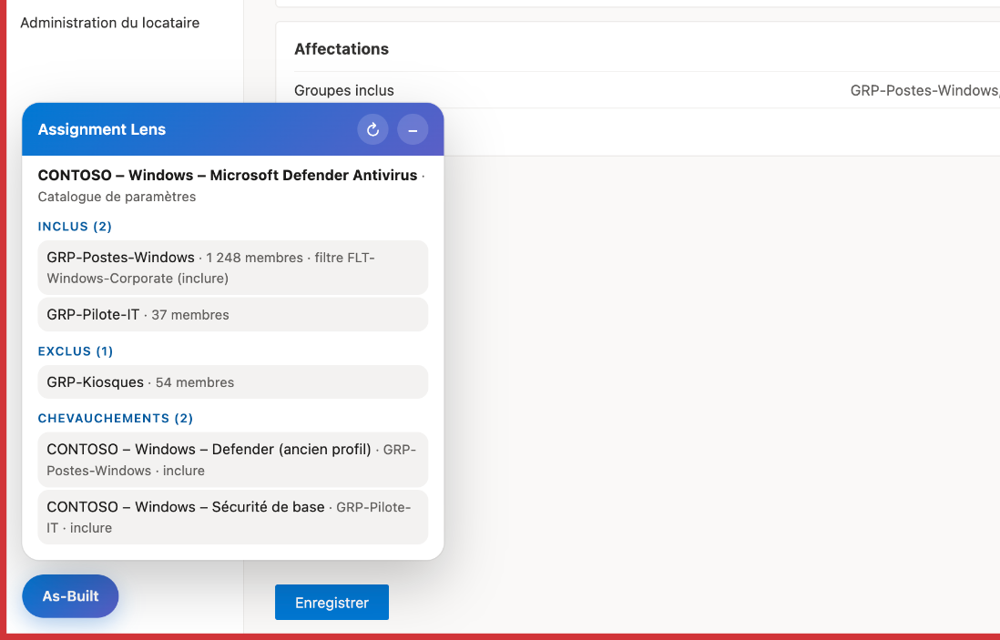

# Tenant Compass

*Boîte à outils pour le portail Microsoft Intune.*

Tenant Guard, As-Built en un clic, Setting Inspector, Assignment Lens, Change Snapshot et Set Tenant Language réunis dans une seule extension Chrome / Edge (MV3). Chaque fonction s'active ou se désactive depuis le menu de l'extension. Aucune application à inscrire dans le tenant : l'extension réutilise la session Microsoft Graph du portail.

Architecture détaillée (scripts, flux, sécurité, stockage) : [ARCHITECTURE.md](ARCHITECTURE.md).



*Captures réalisées sur une maquette du portail avec des données fictives (Contoso), avec le style réel de l'extension.*

## Fonctions

| Fonction | Ce qu'elle fait | Où |
|---|---|---|
| Tenant Guard | Bandeau et cadre de couleur du tenant actif ; confirmation avant Enregistrer, Supprimer, Attribuer, Créer, Wipe, Retire dans un tenant PROD | Portails Intune, Entra, Azure, Defender, M365, Purview, Exchange, Teams |
| As-Built en un clic | Export des stratégies choisies en Markdown, Word et JSON, scripts compris | Bouton en bas à gauche |
| Setting Inspector | Au survol d'un paramètre du catalogue : identifiant, OMA-URI / clé, applicabilité, licence, GPO équivalente, liens Learn | Éditeur et résumé d'une stratégie |
| Assignment Lens | Groupes inclus / exclus, membres, filtres, chevauchements de la stratégie affichée | Bouton au-dessus d'As-Built |
| Change Snapshot | Journal local des modifications : différence avant / après, auteur, n° de ticket, export JSON / CSV | Fenêtre en bas à droite après un enregistrement ; journal depuis le menu |
| Set Tenant Language | Passe la console dans une langue et un format régional prédéfinis, en 1 clic | Pastille 🌐 du menu |

## Installation

1. `edge://extensions` (ou `chrome://extensions`), activer le mode développeur.
2. « Charger l'extension décompressée », choisir le dossier `tenant-compass/`.
3. Désactiver les extensions séparées Tenant Guard, As-Built, Setting Inspector et Assignment Lens si elles sont chargées, sinon tout s'affiche en double.

## Menu

Clic sur l'icône de l'extension. Une ligne de pastilles montre les fonctions actives (description au survol, 📋 ouvre le journal de Change Snapshot, 🌐 applique la langue prédéfinie de la console). Si Tenant Guard est actif, le tenant détecté dans l'onglet et la liste des tenants référencés restent modifiables directement.

| Vue principale | Paramètres (⚙) |
|---|---|
|  |  |

- **FR / EN** (en-tête) : langue de l'extension, Français (FR) ou English (US) : menu, panneaux et fiches dans le portail, boîtes de confirmation, journal, intitulés des exports As-Built. Mémorisée dans le profil du navigateur ; par défaut, la langue du navigateur. Dans le portail, la langue s'applique au rechargement de l'onglet.
- **Bouton bleu « Recharger l'onglet du portail pour appliquer (fonctions et langue) ↻ »** : apparaît après une activation / désactivation ou un changement de langue.
- **📋** (dans la pastille Change Snapshot) : ouvre le journal des modifications.
- **⚙ Paramètres** (s'ouvrent sous les pastilles) :
  - **Fonctions** : une case par fonction, avec sa description. Une fonction décochée n'injecte plus aucun script. Le changement s'applique au prochain chargement de l'onglet (bouton « Recharger l'onglet »).
  - **Set Tenant Language · langue prédéfinie** : langue de la console et format régional appliqués par la pastille 🌐.
  - **Affichage** : **Positions par défaut** replace les boutons et panneaux en bas à gauche.
- **Tenant Guard · tenants référencés** (vue principale) : correspondance, étiquette, couleur, PROD.
  - **Exporter (JSON)** : télécharge `tenant-guard-AAAA-MM-JJ.json` (`{ rules: [{ match, label, color, prod }], customColors: ["#rrggbb"] }`) : correspondance, étiquette, couleur et PROD de chaque tenant, plus « Mes couleurs ».
  - **Couleur** : couleurs prédéfinies, « Mes couleurs », curseurs teinte / luminosité et code `#RRGGBB` dans le menu (aperçu en direct ; clic sur l'aperçu ou Entrée pour appliquer). **Autre…** ouvre le sélecteur de couleur natif dans la page d'options (le sélecteur natif fermerait le menu).
  - **Importer…** : fusionne un fichier exporté ; un tenant de même correspondance est remplacé (étiquette et couleur comprises), « Mes couleurs » sont fusionnées (5 au maximum). Depuis le popup, le bouton ouvre la page d'options en onglet (le popup se ferme quand le sélecteur de fichier s'ouvre).

Ajouter une langue : un dictionnaire dans `shared/i18n.js` (menu) et dans chaque `<fonction>/i18n.js` (mêmes clés), un fichier `shared/lang/<code>.js`, le code dans `LANGS` de `background.js` et un bouton `data-lang` dans `popup.html`.

## Tenant Guard

Bandeau en haut de page (couleur et étiquette du tenant référencé) et cadre de couleur. Dans un tenant marqué PROD, les actions sensibles demandent une confirmation (Échap ou Annuler par défaut) :



Détection du tenant, par ordre de priorité : URL (`tid=`, `tenantId=`, `ctid=`, `#@domaine`), nom de l'annuaire affiché dans l'en-tête, clés du cache MSAL de la page (seulement si un seul tenant y figure). Pour référencer un tenant : menu, *Onglet actuel*, bouton **Référencer** à côté de l'identifiant détecté.

## Setting Inspector

Au survol d'un paramètre du catalogue de paramètres (éditeur ou résumé d'une stratégie) : carte avec l'identifiant de définition, l'OMA-URI (Windows) ou la clé (macOS / iOS), l'applicabilité, la licence et la GPO équivalente (`data/overlay.json`), les liens Microsoft Learn. Le paramètre est reconnu par son identifiant, lu dans le modèle de la page : fonctionne quelle que soit la langue du portail.

Données (`setting-inspector/data/`) :

- `settings.json` : définitions Graph indexées par nom normalisé. La base fournie ne contient que 12 paramètres ; les autres sont capturés au fil de la navigation (réponses Graph du portail, gardées dans `chrome.storage.local`, clé `live`).
- `overlay.json` : licence et GPO équivalente, que Graph n'expose pas. Fusionné à l'exécution : modifier le fichier puis recharger l'extension.

Régénérer la base complète (Node 18+, sans dépendance, compte avec `DeviceManagementConfiguration.Read.All`) :

```sh
az login
export GRAPH_TOKEN=$(az account get-access-token --resource-type ms-graph --query accessToken -o tsv)
node setting-inspector/tools/build-db.mjs   # depuis tenant-compass/, écrase data/settings.json
```

Enrichir l'overlay : pour un paramètre Policy CSP basé sur un ADMX, reporter le tableau **Group policy mapping** de la page Learn du CSP. Ne renseigner que des valeurs vérifiées :

```json
"device_vendor_msft_policy_config_defender_allowarchivescanning": {
  "gpo": {
    "path": "Computer Configuration > Administrative Templates > Windows Components > Microsoft Defender Antivirus > Scan",
    "name": "Scan archive files",
    "admx": "WindowsDefender.admx",
    "registry": "HKLM\\Software\\Policies\\Microsoft\\Windows Defender\\Scan\\DisableArchiveScanning"
  }
}
```

Règles de licence : voir `setting-inspector/LICENSE-RULES-MAINTENANCE.md`.

## As-Built (panneau dans le portail)



- Sources : catalogue de paramètres, profils de configuration, conformité, ADMX, applications, scripts PowerShell, scripts shell macOS, remédiations.
- Filtres : recherche, type, OS.
- Mode d'export : **One Policy per file** (défaut) ou toutes les stratégies dans un seul fichier. « Copier MD » copie toujours un seul bloc.
- **Exporter les scripts** (coché par défaut) : télécharge à côté du document, décodés depuis le Base64 de Graph (`.ps1` / `.sh`), les scripts, remédiations (détection + correction) et scripts PowerShell de détection / exigence des applications Win32.
- Le fichier `.intunewin` n'est pas exportable : Graph n'expose aucune URL de téléchargement d'un contenu d'application publié (l'URI de stockage n'existe que pendant l'upload, et le contenu est chiffré).

## Assignment Lens



Bouton « Assignment Lens » en bas à gauche, juste au-dessus du bouton As-Built, de même taille que celui d'As-Built. Le bouton reste affiché et ouvre / ferme la carte (au-dessus des boutons), comme As-Built. La carte montre la stratégie ou l'application affichée : groupes inclus / exclus, nombre de membres, filtres, cibles virtuelles, chevauchements avec d'autres stratégies. Style aligné sur As-Built. ↻ actualise ; × ou un clic sur le titre ferme la carte.

## Change Snapshot

Trace les modifications de stratégies faites dans le portail. À l'ouverture d'une stratégie, l'extension garde son état ; après un enregistrement réussi, une fenêtre en bas à droite montre la différence et demande un n° de ticket et un commentaire. L'entrée est enregistrée même sans ticket (marquée **sans ticket**). Le journal (bouton **Journal** du menu) se filtre par stratégie, utilisateur et dates, et s'exporte en JSON et CSV (séparateur `;`).

- Auteur et tenant lus dans le jeton du portail (décodage seulement) ; le jeton n'est jamais enregistré. Les valeurs secrètes sont masquées.
- Journal local au navigateur (`chrome.storage.local`, clés `e:<id>`) : utile pour la traçabilité, pas une preuve d'audit infalsifiable.
- Si la stratégie n'a pas été ouverte dans l'onglet avant la modification, la différence part de zéro (signalé).

Détails (flux, points de terminaison couverts, limites) : [change-snapshot/README.md](change-snapshot/README.md).

## Set Tenant Language

Raccourci pour *Paramètres > Langue + région* du portail : choisir une fois, dans ⚙, la langue de la console (24 langues de la console Intune) et le format régional (dates, nombres) ; ensuite, un clic sur la pastille **🌐** recharge l'onglet Intune, Azure ou Entra actif dans cette langue, sur la même page.

- Mécanisme : paramètre d'URL `l=<langue>.<format>` du portail (ex. `?l=en.en-us`). Comportement observé du portail, non documenté sur Microsoft Learn : vérifier sur votre tenant si la langue reste appliquée après une navigation normale.
- Le rechargement perd les modifications non enregistrées de l'onglet.
- Code : `portal-language/lib.js` (testé : `node portal-language/test.js`).

## Déplacement

As-Built et Assignment Lens ne s'ouvrent pas en même temps : ouvrir l'un réduit l'autre en bouton.


Les boutons et panneaux d'As-Built et d'Assignment Lens se déplacent à la souris (bouton : glisser ; panneau : glisser l'en-tête). Position mémorisée par élément dans le `localStorage` du portail (clés `tenant-compass:pos:*`), code commun dans `shared/drag.js`. Bouton **Positions par défaut** dans le menu : efface ces clés dans l'onglet actif et le recharge.

## Fonctionnement

`background.js` enregistre dynamiquement (`chrome.scripting.registerContentScripts`) les scripts des fonctions cochées, d'après `chrome.storage.sync` clé `features` (`{ tenantGuard, asBuilt, settingInspector, assignmentLens }`, toutes actives par défaut). Chaque fonction vit dans son dossier (`tenant-guard/`, `as-built/`, `setting-inspector/`, `assignment-lens/`), avec un `lib.js` testable sous Node et un `test.js`. Le style commun (dégradé #0078d4 → #5b5fc7) et le déplacement (`shared/drag.js`) sont partagés. Détails : [ARCHITECTURE.md](ARCHITECTURE.md).

## Limites

- Les tenants référencés dans l'extension Tenant Guard séparée ne sont pas repris : le stockage est propre à chaque extension, il faut les ressaisir.
- Assignment Lens ne fonctionne que sur `intune.microsoft.com` (pas `endpoint.microsoft.com`).
- Rien n'a été vérifié par des tests automatisés dans le vrai portail : la détection repose sur la structure actuelle du portail et des appels Graph.

## Tests

```
cd tenant-guard && node test.js
cd ../as-built && node test.js
cd ../setting-inspector && node test.js
cd ../assignment-lens && node test.js
cd ../change-snapshot && node test.js
cd ../portal-language && node test.js
```

## Licence

Licence propriétaire, tous droits réservés : utilisation autorisée telle quelle, modification, réutilisation et redistribution interdites sans accord écrit. Voir [LICENSE](LICENSE).
